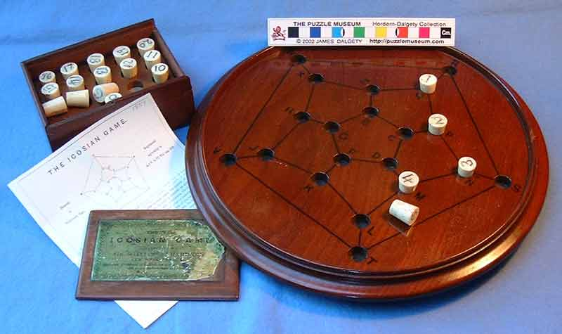

*“A great discovery solves a great problem, but there is a grain of discovery in the solution of any problem. Your problem may be modest, but if it challenges your curiosity and brings into play your inventive faculties, and if you solve it by your own means, you may experience the tension and enjoy the triumph of discovery.”*
― George Pólya, How to Solve It: A New Aspect of Mathematical Method 


<small><em>Planar embedding of a cube and a discocube. From the set of all graphs G, where the order of G is of the ***Uncentered octahedral numbers*** [A130809](https://oeis.org/A130809), only the first two instances shown above; n[0] and n[1] are planarly embeddable i.e., it can be represented on a two-dimensional surface without any of its edges crossing.</em></small>

An algorithm for solving the Hamiltonian cycle problem deterministically and in linear time on all instances of discocube graphs (tested for graphs with over 1 billion vertices). Discocube graphs are
3-dimensional grid graphs derived from: a polycube of an octahedron | a Hauy construction of an octahedron with cubes as identical building blocks | the accretion of cubes around a central cube forming an octahedron at the limit |
the set of points in a 3-dimensional square grid graph contained within an octahedron...

This algorithm is an artist's rendering of a graph object using programming as a language (instead of painting flowers and apples or singing hymns about angels) and means by which to describe his muse's body as an endless contour drawing or a Hamiltonian cycle in graph theory terms.


<div style="display: flex;">
  <div style="flex: 1;">
    
  </div>
  <div style="flex: 2; padding-left: 20px;">
    <p>
      <em>Named after Sir William Rowan Hamilton, the Hamiltonian cycle problem is a classic problem in graph theory. It requires finding a closed loop in a graph that visits every node exactly once, ending at the starting point. The problem was first formulated in the rules of his Icosian game, where players insert numbered pegs into holes on a wooden board to represent steps in a path. The objective is to insert the pegs in order along a path to form a closed loop, much like the Hamiltonian cycle problem where the pegs represent nodes in a graph and the path of inserted pegs represents the cycle.</em>
    </p>
  </div>
</div>


After pages of studies, drawings, and a little math: this is the result of my using the artistic process to solve a mathematical problem without the means to solve it mathematically. When a graph becomes an artist's muse, how does the artist go about rendering their vision as a painter would paint a portrait, making it their own? Will I eventually draw functions with my mind where I otherwise would have imagined a sculpture? Or will I find patterns in the [music I make from the solutions?](https://soundcloud.com/ro-yu-489928073/tracks)

Art manipulates language to create forms, showing us how a brush strokes the curve of the neck to disappear behind the back, or to with play colors and contrasts to bring the skin, of a subject living 500 years ago, back to life. In this project, I studied the discocube visually as a body, imagining each turn not as a discrete mathematical object, but as the totality of possible movements, as an endlessly iterated dance captured in an infinitely open camera shutter, resulting in more doodles and sketches rather than pages of numbers and equations (I wish I learned more math!). The result is a family of algorithms for solving various types of Hamiltonian cycles, of which this repository provides the simplest and most descriptive: the weave algorithm. The other algorithms, housed in another private repository called "polish" center around the concept of polishing a diamond, i.e., improving upon the initial tour created by the weave algorithm so that the number of edges is evenly distributed across the x, y, and z axes, resulting in an always-turning Hamiltonian cycle.
Art manipulates language to create forms, showing us how a brush strokes the curve of the neck to disappear behind the back, or to with play colors and contrasts to bring the skin, of a subject living 500 years ago, back to life. In this project, I studied the discocube visually as a body, imagining each turn not as a discrete mathematical object, but as the totality of possible movements, as an endlessly iterated dance captured in an infinitely open camera shutter, resulting in more doodles and sketches rather than pages of numbers and equations (I wish I learned more math!). The result is a family of algorithms for solving various types of Hamiltonian cycles, of which this repository provides the simplest and most descriptive: the weave algorithm. The other algorithms, housed in another private repository called "polish" center around the concept of polishing a diamond, i.e., improving upon the initial tour created by the weave algorithm so that the number of edges is evenly distributed across the x, y, and z axes, resulting in an always-turning Hamiltonian cycle.
Why weave? Finding the solution to the problem reminded me of macramé, of tying knots, weaving and spinning yarn. I thought of how patterns in hand-woven fabric are actually unwitting recordings of a knitter's hand-movements, like how a piano roll is a recording of the pianist's finger hitting ebony, or how a seismograph records the motion of the earth, or how our skin is type of recording of our life... I followed the thought further and asked myself: was there was a pattern to expose and use to construct the discocube, level by level, similar to how one would knit a scarf, row by row until the desired result is reached? To illustrate the intention of the code succinctly, I've structured the code to mimic the process of weaving a piece of tapestry, from spinning the yarn to incorporating the weft into the warps. 


*The first eleven discocubes and their respective orders (number of nodes)*

To paraphrase Hauy: 

*When solving problems that involve analyzing how nature progresses, we are led by very rapid methods to results that are not immediately obvious. These results may appear paradoxical and surprising. However, if we take the time to carefully examine the steps we took to reach these results, we will begin to understand the underlying principles that led to these outcomes. By going back over the process step by step, we can better understand the logic behind the final results.*

What started as a hack-your-own version of a depth-first-search-with-shortcuts for the discocube graph (solving up to 960 vertices), metastasized into pages of overgrown mixin classes mysteriously coupled to each another like overgrown vines pushing me deeper and deeper into the underbelly of its mutant tentacles. Although able to solve instances with over a million vertices, the algorithm had the clarity of primordial soup. So, as a sadistic gardener I painstakingly pruned my own pubicity (my unescapable web of thorny vines) into presentable tiny bonsai trees. So what is a bonsai if not a tree in intimate scope?

The result of this creative process is a family of algorithms developed specifically to solve various graph problems on the disoocube graph, 3d grid graph and hexprism honeycomb diamond graphs. 
The algorithm presented in this repository is the least complex, making it the fastest. It does the job, solving the hamiltonian cycle problem for over millions of vertices in seconds and graph with over a billion vertices in minutes -while other algorithms in the family take longer but they also have other objectives; like forming an always turning cycle with even edge distribution across all axes. But that's beyond the scope of this repository.

Eventually this repository will include other linear time algorithms for solving the hamiltonian cycle problem in 3d grid graphs and also in solid grid graphs (a side-effect of the research) and regular grid graphs.

This algorithm has no while loops, and will terminate after a definitive set of steps. The strength of this algorithm is knowing exactly when and where and what is to happen, thereby reducing the amount of calculations needed (which is surprising as the creative process in creating this was anything but deterministic). It is a construction algorithm, constructing the path, layer by layer until a series of loops are produced with are then joined using cycle merging. The algorithm has also discarded the memory-heavy adjacency list, choosing instead to perform individual calculations where needed. Making and solving a graph with over a billion vertices, where n=1000 won't require a distributed graph engine on the cloud anymore. Just a little over ten minutes.


*Discocubes 8 - 1760*


*Hexprism Honeycomb Diamond*

### digital discocubes
As each solution is as unique as a fingerprint, or a diamond it allows one to have their own digital version of a discocube, which is also an instruction for building your own.

 

*Discocubes as glb, using different mirrored texture yields personalized results and unique reflections meaning each discocube has its own reflection/shadow fingerprint! With millions of combinations available (glass texture/image/color, mirror texture/image/color, edge texture/image/color), the possibilities are endless!*

The always turning hamiltonian cycle digital discocubes are not produced by the algorithm in this repository, but by another polynomial-time algorithm.


*Detail for a Hamiltonian cycle for a graph with 79,040 nodes.*

## Command line usage
To use the package via the command line, navigate to the root directory of the project in your terminal and run the following command:
```
cargo run --release [Graph start instance] [Graph end instance]
```
```
cargo run --release 1 100
```
build > run > make > solve > certify > for each graph starting from 32 to 1.373 million vertices.

## Plotting the solution
The solution can be plotted using pandas, numpy and plotly. I've put together an easy to use python module: https://github.com/discocube/plot_solution to plot and very the solution visually instead of only programmatically.


## Plotting the solution
The solution can be plotted using pandas, numpy and plotly. I've put together an easy to use python module: https://github.com/discocube/plot_solution to plot and very the solution visually instead of only programmatically.


## Running times

8_to_68085920.png

#### Running times for the first 600 instances: graphs with 8 to 289_441_600 vertices (to be continued until 1000th order (over 1 billion)):
```
| 🇳    1 | ⭕️          8 | 🕗 0.000010179  | 📌 HamCycle |
| 🇳    2 | ⭕️         32 | 🕗 0.000018255  | 📌 HamCycle |
| 🇳    3 | ⭕️         80 | 🕗 0.000283618  | 📌 HamCycle |
| 🇳    4 | ⭕️        160 | 🕗 0.000169882  | 📌 HamCycle |
| 🇳    5 | ⭕️        280 | 🕗 0.00030587   | 📌 HamCycle |
| 🇳    6 | ⭕️        448 | 🕗 0.000337921  | 📌 HamCycle |
| 🇳    7 | ⭕️        672 | 🕗 0.000539654  | 📌 HamCycle |
| 🇳    8 | ⭕️        960 | 🕗 0.00050552   | 📌 HamCycle |
| 🇳    9 | ⭕️       1320 | 🕗 0.000522511  | 📌 HamCycle |
| 🇳   10 | ⭕️       1760 | 🕗 0.000824325  | 📌 HamCycle |
| 🇳   11 | ⭕️       2288 | 🕗 0.000646206  | 📌 HamCycle |
| 🇳   12 | ⭕️       2912 | 🕗 0.000703355  | 📌 HamCycle |
| 🇳   13 | ⭕️       3640 | 🕗 0.000800429  | 📌 HamCycle |
| 🇳   14 | ⭕️       4480 | 🕗 0.000998104  | 📌 HamCycle |
| 🇳   15 | ⭕️       5440 | 🕗 0.001419092  | 📌 HamCycle |
| 🇳   16 | ⭕️       6528 | 🕗 0.001677904  | 📌 HamCycle |
| 🇳   17 | ⭕️       7752 | 🕗 0.001635744  | 📌 HamCycle |
| 🇳   18 | ⭕️       9120 | 🕗 0.001986249  | 📌 HamCycle |
| 🇳   19 | ⭕️      10640 | 🕗 0.001993143  | 📌 HamCycle |
| 🇳   20 | ⭕️      12320 | 🕗 0.00203425   | 📌 HamCycle |
| 🇳   21 | ⭕️      14168 | 🕗 0.002479435  | 📌 HamCycle |
| 🇳   22 | ⭕️      16192 | 🕗 0.002503029  | 📌 HamCycle |
| 🇳   23 | ⭕️      18400 | 🕗 0.00254034   | 📌 HamCycle |
| 🇳   24 | ⭕️      20800 | 🕗 0.002812948  | 📌 HamCycle |
| 🇳   25 | ⭕️      23400 | 🕗 0.003037193  | 📌 HamCycle |
| 🇳   26 | ⭕️      26208 | 🕗 0.003922813  | 📌 HamCycle |
| 🇳   27 | ⭕️      29232 | 🕗 0.003849575  | 📌 HamCycle |
| 🇳   28 | ⭕️      32480 | 🕗 0.004456847  | 📌 HamCycle |
| 🇳   29 | ⭕️      35960 | 🕗 0.004726588  | 📌 HamCycle |
| 🇳   30 | ⭕️      39680 | 🕗 0.004998615  | 📌 HamCycle |
| 🇳   31 | ⭕️      43648 | 🕗 0.00612388   | 📌 HamCycle |
| 🇳   32 | ⭕️      47872 | 🕗 0.006315073  | 📌 HamCycle |
| 🇳   33 | ⭕️      52360 | 🕗 0.005878725  | 📌 HamCycle |
| 🇳   34 | ⭕️      57120 | 🕗 0.007008919  | 📌 HamCycle |
| 🇳   35 | ⭕️      62160 | 🕗 0.007347783  | 📌 HamCycle |
| 🇳   36 | ⭕️      67488 | 🕗 0.007969702  | 📌 HamCycle |
| 🇳   37 | ⭕️      73112 | 🕗 0.0095493    | 📌 HamCycle |
| 🇳   38 | ⭕️      79040 | 🕗 0.011495343  | 📌 HamCycle |
| 🇳   39 | ⭕️      85280 | 🕗 0.0121266    | 📌 HamCycle |
| 🇳   40 | ⭕️      91840 | 🕗 0.013320286  | 📌 HamCycle |
| 🇳   41 | ⭕️      98728 | 🕗 0.013511047  | 📌 HamCycle |
| 🇳   42 | ⭕️     105952 | 🕗 0.013991549  | 📌 HamCycle |
| 🇳   43 | ⭕️     113520 | 🕗 0.015163283  | 📌 HamCycle |
| 🇳   44 | ⭕️     121440 | 🕗 0.01770702   | 📌 HamCycle |
| 🇳   45 | ⭕️     129720 | 🕗 0.020936416  | 📌 HamCycle |
| 🇳   46 | ⭕️     138368 | 🕗 0.021208504  | 📌 HamCycle |
| 🇳   47 | ⭕️     147392 | 🕗 0.024101734  | 📌 HamCycle |
| 🇳   48 | ⭕️     156800 | 🕗 0.022927316  | 📌 HamCycle |
| 🇳   49 | ⭕️     166600 | 🕗 0.026293512  | 📌 HamCycle |
| 🇳   50 | ⭕️     176800 | 🕗 0.029030116  | 📌 HamCycle |
| 🇳   51 | ⭕️     187408 | 🕗 0.029561944  | 📌 HamCycle |
| 🇳   52 | ⭕️     198432 | 🕗 0.029597571  | 📌 HamCycle |
| 🇳   53 | ⭕️     209880 | 🕗 0.031674866  | 📌 HamCycle |
| 🇳   54 | ⭕️     221760 | 🕗 0.033894274  | 📌 HamCycle |
| 🇳   55 | ⭕️     234080 | 🕗 0.039308295  | 📌 HamCycle |
| 🇳   56 | ⭕️     246848 | 🕗 0.040414516  | 📌 HamCycle |
| 🇳   57 | ⭕️     260072 | 🕗 0.042420182  | 📌 HamCycle |
| 🇳   58 | ⭕️     273760 | 🕗 0.042702727  | 📌 HamCycle |
| 🇳   59 | ⭕️     287920 | 🕗 0.044963486  | 📌 HamCycle |
| 🇳   60 | ⭕️     302560 | 🕗 0.05224782   | 📌 HamCycle |
| 🇳   61 | ⭕️     317688 | 🕗 0.055054758  | 📌 HamCycle |
| 🇳   62 | ⭕️     333312 | 🕗 0.060857207  | 📌 HamCycle |
| 🇳   63 | ⭕️     349440 | 🕗 0.05793857   | 📌 HamCycle |
| 🇳   64 | ⭕️     366080 | 🕗 0.06330587   | 📌 HamCycle |
| 🇳   65 | ⭕️     383240 | 🕗 0.068265855  | 📌 HamCycle |
| 🇳   66 | ⭕️     400928 | 🕗 0.068454966  | 📌 HamCycle |
| 🇳   67 | ⭕️     419152 | 🕗 0.0774078    | 📌 HamCycle |
| 🇳   68 | ⭕️     437920 | 🕗 0.08340845   | 📌 HamCycle |
| 🇳   69 | ⭕️     457240 | 🕗 0.092542306  | 📌 HamCycle |
| 🇳   70 | ⭕️     477120 | 🕗 0.09312241   | 📌 HamCycle |
| 🇳   71 | ⭕️     497568 | 🕗 0.0949187    | 📌 HamCycle |
| 🇳   72 | ⭕️     518592 | 🕗 0.10142887   | 📌 HamCycle |
| 🇳   73 | ⭕️     540200 | 🕗 0.09735174   | 📌 HamCycle |
| 🇳   74 | ⭕️     562400 | 🕗 0.11714704   | 📌 HamCycle |
| 🇳   75 | ⭕️     585200 | 🕗 0.12063946   | 📌 HamCycle |
| 🇳   76 | ⭕️     608608 | 🕗 0.11892852   | 📌 HamCycle |
| 🇳   77 | ⭕️     632632 | 🕗 0.12712795   | 📌 HamCycle |
| 🇳   78 | ⭕️     657280 | 🕗 0.13093683   | 📌 HamCycle |
| 🇳   79 | ⭕️     682560 | 🕗 0.13360427   | 📌 HamCycle |
| 🇳   80 | ⭕️     708480 | 🕗 0.13917398   | 📌 HamCycle |
| 🇳   81 | ⭕️     735048 | 🕗 0.14792669   | 📌 HamCycle |
| 🇳   82 | ⭕️     762272 | 🕗 0.16350742   | 📌 HamCycle |
| 🇳   83 | ⭕️     790160 | 🕗 0.16328318   | 📌 HamCycle |
| 🇳   84 | ⭕️     818720 | 🕗 0.16780606   | 📌 HamCycle |
| 🇳   85 | ⭕️     847960 | 🕗 0.16695078   | 📌 HamCycle |
| 🇳   86 | ⭕️     877888 | 🕗 0.17740835   | 📌 HamCycle |
| 🇳   87 | ⭕️     908512 | 🕗 0.19069728   | 📌 HamCycle |
| 🇳   88 | ⭕️     939840 | 🕗 0.18747258   | 📌 HamCycle |
| 🇳   89 | ⭕️     971880 | 🕗 0.20597778   | 📌 HamCycle |
| 🇳   90 | ⭕️    1004640 | 🕗 0.21213219   | 📌 HamCycle |
| 🇳   91 | ⭕️    1038128 | 🕗 0.22415698   | 📌 HamCycle |
| 🇳   92 | ⭕️    1072352 | 🕗 0.22618763   | 📌 HamCycle |
| 🇳   93 | ⭕️    1107320 | 🕗 0.22506136   | 📌 HamCycle |
| 🇳   94 | ⭕️    1143040 | 🕗 0.25826323   | 📌 HamCycle |
| 🇳   95 | ⭕️    1179520 | 🕗 0.28059712   | 📌 HamCycle |
| 🇳   96 | ⭕️    1216768 | 🕗 0.2955699    | 📌 HamCycle |
| 🇳   97 | ⭕️    1254792 | 🕗 0.29338446   | 📌 HamCycle |
| 🇳   98 | ⭕️    1293600 | 🕗 0.30179793   | 📌 HamCycle |
| 🇳   99 | ⭕️    1333200 | 🕗 0.2997555    | 📌 HamCycle |
| 🇳  100 | ⭕️    1373600 | 🕗 0.30730814   | 📌 HamCycle |
| 🇳  101 | ⭕️    1414808 | 🕗 0.3379341    | 📌 HamCycle |
| 🇳  102 | ⭕️    1456832 | 🕗 0.33156005   | 📌 HamCycle |
| 🇳  103 | ⭕️    1499680 | 🕗 0.34553766   | 📌 HamCycle |
| 🇳  104 | ⭕️    1543360 | 🕗 0.3442304    | 📌 HamCycle |
| 🇳  105 | ⭕️    1587880 | 🕗 0.36213267   | 📌 HamCycle |
| 🇳  106 | ⭕️    1633248 | 🕗 0.37605652   | 📌 HamCycle |
| 🇳  107 | ⭕️    1679472 | 🕗 0.3725381    | 📌 HamCycle |
| 🇳  108 | ⭕️    1726560 | 🕗 0.41962066   | 📌 HamCycle |
| 🇳  109 | ⭕️    1774520 | 🕗 0.43811184   | 📌 HamCycle |
| 🇳  110 | ⭕️    1823360 | 🕗 0.46622387   | 📌 HamCycle |
| 🇳  111 | ⭕️    1873088 | 🕗 0.45527634   | 📌 HamCycle |
| 🇳  112 | ⭕️    1923712 | 🕗 0.45899248   | 📌 HamCycle |
| 🇳  113 | ⭕️    1975240 | 🕗 0.4656841    | 📌 HamCycle |
| 🇳  114 | ⭕️    2027680 | 🕗 0.51470727   | 📌 HamCycle |
| 🇳  115 | ⭕️    2081040 | 🕗 0.55015206   | 📌 HamCycle |
| 🇳  116 | ⭕️    2135328 | 🕗 0.5460732    | 📌 HamCycle |
| 🇳  117 | ⭕️    2190552 | 🕗 0.574392     | 📌 HamCycle |
| 🇳  118 | ⭕️    2246720 | 🕗 0.594223     | 📌 HamCycle |
| 🇳  119 | ⭕️    2303840 | 🕗 0.62288606   | 📌 HamCycle |
| 🇳  120 | ⭕️    2361920 | 🕗 0.6434338    | 📌 HamCycle |
| 🇳  121 | ⭕️    2420968 | 🕗 0.6429697    | 📌 HamCycle |
| 🇳  122 | ⭕️    2480992 | 🕗 0.6714702    | 📌 HamCycle |
| 🇳  123 | ⭕️    2542000 | 🕗 0.69785696   | 📌 HamCycle |
| 🇳  124 | ⭕️    2604000 | 🕗 0.70497197   | 📌 HamCycle |
| 🇳  125 | ⭕️    2667000 | 🕗 0.727654     | 📌 HamCycle |
| 🇳  126 | ⭕️    2731008 | 🕗 0.73778033   | 📌 HamCycle |
| 🇳  127 | ⭕️    2796032 | 🕗 0.7767268    | 📌 HamCycle |
| 🇳  128 | ⭕️    2862080 | 🕗 0.78686845   | 📌 HamCycle |
| 🇳  129 | ⭕️    2929160 | 🕗 0.8504334    | 📌 HamCycle |
| 🇳  130 | ⭕️    2997280 | 🕗 0.87121445   | 📌 HamCycle |
| 🇳  131 | ⭕️    3066448 | 🕗 0.8745579    | 📌 HamCycle |
| 🇳  132 | ⭕️    3136672 | 🕗 0.8868567    | 📌 HamCycle |
| 🇳  133 | ⭕️    3207960 | 🕗 0.94231975   | 📌 HamCycle |
| 🇳  134 | ⭕️    3280320 | 🕗 0.9914202    | 📌 HamCycle |
| 🇳  135 | ⭕️    3353760 | 🕗 1.0388473    | 📌 HamCycle |
| 🇳  136 | ⭕️    3428288 | 🕗 1.0109073    | 📌 HamCycle |
| 🇳  137 | ⭕️    3503912 | 🕗 1.0276672    | 📌 HamCycle |
| 🇳  138 | ⭕️    3580640 | 🕗 1.1127745    | 📌 HamCycle |
| 🇳  139 | ⭕️    3658480 | 🕗 1.1656529    | 📌 HamCycle |
| 🇳  140 | ⭕️    3737440 | 🕗 1.1707357    | 📌 HamCycle |
| 🇳  141 | ⭕️    3817528 | 🕗 1.1739498    | 📌 HamCycle |
| 🇳  142 | ⭕️    3898752 | 🕗 1.1887686    | 📌 HamCycle |
| 🇳  143 | ⭕️    3981120 | 🕗 1.244189     | 📌 HamCycle |
| 🇳  144 | ⭕️    4064640 | 🕗 1.2615665    | 📌 HamCycle |
| 🇳  145 | ⭕️    4149320 | 🕗 1.345032     | 📌 HamCycle |
| 🇳  146 | ⭕️    4235168 | 🕗 1.3407199    | 📌 HamCycle |
| 🇳  147 | ⭕️    4322192 | 🕗 1.3436819    | 📌 HamCycle |
| 🇳  148 | ⭕️    4410400 | 🕗 1.4318922    | 📌 HamCycle |
| 🇳  149 | ⭕️    4499800 | 🕗 1.4623578    | 📌 HamCycle |
| 🇳  150 | ⭕️    4590400 | 🕗 1.532712     | 📌 HamCycle |
| 🇳  151 | ⭕️    4682208 | 🕗 1.5433009    | 📌 HamCycle |
| 🇳  152 | ⭕️    4775232 | 🕗 1.5713217    | 📌 HamCycle |
| 🇳  153 | ⭕️    4869480 | 🕗 1.6167154    | 📌 HamCycle |
| 🇳  154 | ⭕️    4964960 | 🕗 1.6924952    | 📌 HamCycle |
| 🇳  155 | ⭕️    5061680 | 🕗 1.8206146    | 📌 HamCycle |
| 🇳  156 | ⭕️    5159648 | 🕗 1.8619893    | 📌 HamCycle |
| 🇳  157 | ⭕️    5258872 | 🕗 1.8311862    | 📌 HamCycle |
| 🇳  158 | ⭕️    5359360 | 🕗 1.9049762    | 📌 HamCycle |
| 🇳  159 | ⭕️    5461120 | 🕗 1.7879434    | 📌 HamCycle |
| 🇳  160 | ⭕️    5564160 | 🕗 1.9257221    | 📌 HamCycle |
| 🇳  161 | ⭕️    5668488 | 🕗 2.0300062    | 📌 HamCycle |
| 🇳  162 | ⭕️    5774112 | 🕗 2.0281081    | 📌 HamCycle |
| 🇳  163 | ⭕️    5881040 | 🕗 2.1137042    | 📌 HamCycle |
| 🇳  164 | ⭕️    5989280 | 🕗 2.1011171    | 📌 HamCycle |
| 🇳  165 | ⭕️    6098840 | 🕗 2.2316356    | 📌 HamCycle |
| 🇳  166 | ⭕️    6209728 | 🕗 2.2139678    | 📌 HamCycle |
| 🇳  167 | ⭕️    6321952 | 🕗 2.2026684    | 📌 HamCycle |
| 🇳  168 | ⭕️    6435520 | 🕗 2.2135189    | 📌 HamCycle |
| 🇳  169 | ⭕️    6550440 | 🕗 2.470571     | 📌 HamCycle |
| 🇳  170 | ⭕️    6666720 | 🕗 2.48348      | 📌 HamCycle |
| 🇳  171 | ⭕️    6784368 | 🕗 2.5992546    | 📌 HamCycle |
| 🇳  172 | ⭕️    6903392 | 🕗 2.559159     | 📌 HamCycle |
| 🇳  173 | ⭕️    7023800 | 🕗 2.6966982    | 📌 HamCycle |
| 🇳  174 | ⭕️    7145600 | 🕗 2.7312272    | 📌 HamCycle |
| 🇳  175 | ⭕️    7268800 | 🕗 2.8405538    | 📌 HamCycle |
| 🇳  176 | ⭕️    7393408 | 🕗 2.8336015    | 📌 HamCycle |
| 🇳  177 | ⭕️    7519432 | 🕗 2.9871907    | 📌 HamCycle |
| 🇳  178 | ⭕️    7646880 | 🕗 3.0249138    | 📌 HamCycle |
| 🇳  179 | ⭕️    7775760 | 🕗 3.1628473    | 📌 HamCycle |
| 🇳  180 | ⭕️    7906080 | 🕗 3.1857908    | 📌 HamCycle |
| 🇳  181 | ⭕️    8037848 | 🕗 3.2282696    | 📌 HamCycle |
| 🇳  182 | ⭕️    8171072 | 🕗 3.274109     | 📌 HamCycle |
| 🇳  183 | ⭕️    8305760 | 🕗 3.3035817    | 📌 HamCycle |
| 🇳  184 | ⭕️    8441920 | 🕗 3.289866     | 📌 HamCycle |
| 🇳  185 | ⭕️    8579560 | 🕗 3.4607885    | 📌 HamCycle |
| 🇳  186 | ⭕️    8718688 | 🕗 3.6351204    | 📌 HamCycle |
| 🇳  187 | ⭕️    8859312 | 🕗 3.670026     | 📌 HamCycle |
| 🇳  188 | ⭕️    9001440 | 🕗 3.7371466    | 📌 HamCycle |
| 🇳  189 | ⭕️    9145080 | 🕗 3.751327     | 📌 HamCycle |
| 🇳  190 | ⭕️    9290240 | 🕗 3.754137     | 📌 HamCycle |
| 🇳  191 | ⭕️    9436928 | 🕗 3.969777     | 📌 HamCycle |
| 🇳  192 | ⭕️    9585152 | 🕗 3.9433873    | 📌 HamCycle |
| 🇳  193 | ⭕️    9734920 | 🕗 4.0607295    | 📌 HamCycle |
| 🇳  194 | ⭕️    9886240 | 🕗 4.1339374    | 📌 HamCycle |
| 🇳  195 | ⭕️   10039120 | 🕗 4.246082     | 📌 HamCycle |
| 🇳  196 | ⭕️   10193568 | 🕗 4.1792674    | 📌 HamCycle |
| 🇳  197 | ⭕️   10349592 | 🕗 4.533998     | 📌 HamCycle |
| 🇳  198 | ⭕️   10507200 | 🕗 4.5180454    | 📌 HamCycle |
| 🇳  199 | ⭕️   10666400 | 🕗 4.54856      | 📌 HamCycle |
| 🇳  200 | ⭕️   10827200 | 🕗 4.7725883    | 📌 HamCycle |
| 🇳  201 | ⭕️   10989608 | 🕗 4.744052     | 📌 HamCycle |
| 🇳  202 | ⭕️   11153632 | 🕗 4.8175836    | 📌 HamCycle |
| 🇳  203 | ⭕️   11319280 | 🕗 5.069594     | 📌 HamCycle |
| 🇳  204 | ⭕️   11486560 | 🕗 5.1115675    | 📌 HamCycle |
| 🇳  205 | ⭕️   11655480 | 🕗 5.2389784    | 📌 HamCycle |
| 🇳  206 | ⭕️   11826048 | 🕗 5.1980133    | 📌 HamCycle |
| 🇳  207 | ⭕️   11998272 | 🕗 5.5012507    | 📌 HamCycle |
| 🇳  208 | ⭕️   12172160 | 🕗 5.5820823    | 📌 HamCycle |
| 🇳  209 | ⭕️   12347720 | 🕗 5.5717516    | 📌 HamCycle |
| 🇳  210 | ⭕️   12524960 | 🕗 5.9001365    | 📌 HamCycle |
| 🇳  211 | ⭕️   12703888 | 🕗 5.900571     | 📌 HamCycle |
| 🇳  212 | ⭕️   12884512 | 🕗 5.9751453    | 📌 HamCycle |
| 🇳  213 | ⭕️   13066840 | 🕗 5.9047737    | 📌 HamCycle |
| 🇳  214 | ⭕️   13250880 | 🕗 6.0134053    | 📌 HamCycle |
| 🇳  215 | ⭕️   13436640 | 🕗 6.187554     | 📌 HamCycle |
| 🇳  216 | ⭕️   13624128 | 🕗 6.2958107    | 📌 HamCycle |
| 🇳  217 | ⭕️   13813352 | 🕗 6.564789     | 📌 HamCycle |
| 🇳  218 | ⭕️   14004320 | 🕗 6.830187     | 📌 HamCycle |
| 🇳  219 | ⭕️   14197040 | 🕗 6.839751     | 📌 HamCycle |
| 🇳  220 | ⭕️   14391520 | 🕗 7.0278063    | 📌 HamCycle |
| 🇳  221 | ⭕️   14587768 | 🕗 6.978607     | 📌 HamCycle |
| 🇳  222 | ⭕️   14785792 | 🕗 6.8333755    | 📌 HamCycle |
| 🇳  223 | ⭕️   14985600 | 🕗 7.375588     | 📌 HamCycle |
| 🇳  224 | ⭕️   15187200 | 🕗 7.6024384    | 📌 HamCycle |
| 🇳  225 | ⭕️   15390600 | 🕗 7.7625895    | 📌 HamCycle |
| 🇳  226 | ⭕️   15595808 | 🕗 7.8449244    | 📌 HamCycle |
| 🇳  227 | ⭕️   15802832 | 🕗 7.8937597    | 📌 HamCycle |
| 🇳  228 | ⭕️   16011680 | 🕗 7.793078     | 📌 HamCycle |
| 🇳  229 | ⭕️   16222360 | 🕗 8.249264     | 📌 HamCycle |
| 🇳  230 | ⭕️   16434880 | 🕗 8.309665     | 📌 HamCycle |
| 🇳  231 | ⭕️   16649248 | 🕗 8.509145     | 📌 HamCycle |
| 🇳  232 | ⭕️   16865472 | 🕗 8.494013     | 📌 HamCycle |
| 🇳  233 | ⭕️   17083560 | 🕗 8.75697      | 📌 HamCycle |
| 🇳  234 | ⭕️   17303520 | 🕗 8.867424     | 📌 HamCycle |
| 🇳  235 | ⭕️   17525360 | 🕗 8.971322     | 📌 HamCycle |
| 🇳  236 | ⭕️   17749088 | 🕗 9.290791     | 📌 HamCycle |
| 🇳  237 | ⭕️   17974712 | 🕗 9.681785     | 📌 HamCycle |
| 🇳  238 | ⭕️   18202240 | 🕗 9.567891     | 📌 HamCycle |
| 🇳  239 | ⭕️   18431680 | 🕗 9.648733     | 📌 HamCycle |
| 🇳  240 | ⭕️   18663040 | 🕗 9.743435     | 📌 HamCycle |
| 🇳  241 | ⭕️   18896328 | 🕗 10.138957    | 📌 HamCycle |
| 🇳  242 | ⭕️   19131552 | 🕗 10.1319895   | 📌 HamCycle |
| 🇳  243 | ⭕️   19368720 | 🕗 10.484348    | 📌 HamCycle |
| 🇳  244 | ⭕️   19607840 | 🕗 10.392075    | 📌 HamCycle |
| 🇳  245 | ⭕️   19848920 | 🕗 10.452226    | 📌 HamCycle |
| 🇳  246 | ⭕️   20091968 | 🕗 10.9395485   | 📌 HamCycle |
| 🇳  247 | ⭕️   20336992 | 🕗 11.00781     | 📌 HamCycle |
| 🇳  248 | ⭕️   20584000 | 🕗 11.238273    | 📌 HamCycle |
| 🇳  249 | ⭕️   20833000 | 🕗 11.500829    | 📌 HamCycle |
| 🇳  250 | ⭕️   21084000 | 🕗 11.707056    | 📌 HamCycle |
| 🇳  251 | ⭕️   21337008 | 🕗 11.882931    | 📌 HamCycle |
| 🇳  252 | ⭕️   21592032 | 🕗 12.065309    | 📌 HamCycle |
| 🇳  253 | ⭕️   21849080 | 🕗 12.268994    | 📌 HamCycle |
| 🇳  254 | ⭕️   22108160 | 🕗 12.600367    | 📌 HamCycle |
| 🇳  255 | ⭕️   22369280 | 🕗 13.023065    | 📌 HamCycle |
| 🇳  256 | ⭕️   22632448 | 🕗 12.539975    | 📌 HamCycle |
| 🇳  257 | ⭕️   22897672 | 🕗 12.856799    | 📌 HamCycle |
| 🇳  258 | ⭕️   23164960 | 🕗 12.903861    | 📌 HamCycle |
| 🇳  259 | ⭕️   23434320 | 🕗 13.518628    | 📌 HamCycle |
| 🇳  260 | ⭕️   23705760 | 🕗 13.740718    | 📌 HamCycle |
| 🇳  261 | ⭕️   23979288 | 🕗 13.776897    | 📌 HamCycle |
| 🇳  262 | ⭕️   24254912 | 🕗 13.713969    | 📌 HamCycle |
| 🇳  263 | ⭕️   24532640 | 🕗 14.200993    | 📌 HamCycle |
| 🇳  264 | ⭕️   24812480 | 🕗 14.683668    | 📌 HamCycle |
| 🇳  265 | ⭕️   25094440 | 🕗 14.797649    | 📌 HamCycle |
| 🇳  266 | ⭕️   25378528 | 🕗 14.8939      | 📌 HamCycle |
| 🇳  267 | ⭕️   25664752 | 🕗 15.082576    | 📌 HamCycle |
| 🇳  268 | ⭕️   25953120 | 🕗 15.450015    | 📌 HamCycle |
| 🇳  269 | ⭕️   26243640 | 🕗 15.281745    | 📌 HamCycle |
| 🇳  270 | ⭕️   26536320 | 🕗 16.039795    | 📌 HamCycle |
| 🇳  271 | ⭕️   26831168 | 🕗 16.043816    | 📌 HamCycle |
| 🇳  272 | ⭕️   27128192 | 🕗 16.194965    | 📌 HamCycle |
| 🇳  273 | ⭕️   27427400 | 🕗 16.245487    | 📌 HamCycle |
| 🇳  274 | ⭕️   27728800 | 🕗 16.96553     | 📌 HamCycle |
| 🇳  275 | ⭕️   28032400 | 🕗 16.721748    | 📌 HamCycle |
| 🇳  276 | ⭕️   28338208 | 🕗 17.652445    | 📌 HamCycle |
| 🇳  277 | ⭕️   28646232 | 🕗 17.599913    | 📌 HamCycle |
| 🇳  278 | ⭕️   28956480 | 🕗 17.16386     | 📌 HamCycle |
| 🇳  279 | ⭕️   29268960 | 🕗 17.591763    | 📌 HamCycle |
| 🇳  280 | ⭕️   29583680 | 🕗 17.99549     | 📌 HamCycle |
| 🇳  281 | ⭕️   29900648 | 🕗 18.62527     | 📌 HamCycle |
| 🇳  282 | ⭕️   30219872 | 🕗 18.930893    | 📌 HamCycle |
| 🇳  283 | ⭕️   30541360 | 🕗 19.07169     | 📌 HamCycle |
| 🇳  284 | ⭕️   30865120 | 🕗 19.62686     | 📌 HamCycle |
| 🇳  285 | ⭕️   31191160 | 🕗 19.488274    | 📌 HamCycle |
| 🇳  286 | ⭕️   31519488 | 🕗 19.766228    | 📌 HamCycle |
| 🇳  287 | ⭕️   31850112 | 🕗 20.576672    | 📌 HamCycle |
| 🇳  288 | ⭕️   32183040 | 🕗 20.503284    | 📌 HamCycle |
| 🇳  289 | ⭕️   32518280 | 🕗 20.625124    | 📌 HamCycle |
| 🇳  290 | ⭕️   32855840 | 🕗 20.646198    | 📌 HamCycle |
| 🇳  291 | ⭕️   33195728 | 🕗 21.04433     | 📌 HamCycle |
| 🇳  292 | ⭕️   33537952 | 🕗 21.503906    | 📌 HamCycle |
| 🇳  293 | ⭕️   33882520 | 🕗 22.053566    | 📌 HamCycle |
| 🇳  294 | ⭕️   34229440 | 🕗 22.439325    | 📌 HamCycle |
| 🇳  295 | ⭕️   34578720 | 🕗 22.41768     | 📌 HamCycle |
| 🇳  296 | ⭕️   34930368 | 🕗 22.739496    | 📌 HamCycle |
| 🇳  297 | ⭕️   35284392 | 🕗 23.121439    | 📌 HamCycle |
| 🇳  298 | ⭕️   35640800 | 🕗 23.281982    | 📌 HamCycle |
| 🇳  299 | ⭕️   35999600 | 🕗 23.352985    | 📌 HamCycle |
| 🇳  300 | ⭕️   36360800 | 🕗 23.841917    | 📌 HamCycle |
| 🇳  301 | ⭕️   36724408 | 🕗 24.645237    | 📌 HamCycle |
| 🇳  302 | ⭕️   37090432 | 🕗 24.904644    | 📌 HamCycle |
| 🇳  303 | ⭕️   37458880 | 🕗 25.39366     | 📌 HamCycle |
| 🇳  304 | ⭕️   37829760 | 🕗 25.662151    | 📌 HamCycle |
| 🇳  305 | ⭕️   38203080 | 🕗 25.057665    | 📌 HamCycle |
| 🇳  306 | ⭕️   38578848 | 🕗 26.07478     | 📌 HamCycle |
| 🇳  307 | ⭕️   38957072 | 🕗 26.506424    | 📌 HamCycle |
| 🇳  308 | ⭕️   39337760 | 🕗 26.259256    | 📌 HamCycle |
| 🇳  309 | ⭕️   39720920 | 🕗 26.389694    | 📌 HamCycle |
| 🇳  310 | ⭕️   40106560 | 🕗 27.441545    | 📌 HamCycle |
| 🇳  311 | ⭕️   40494688 | 🕗 27.387396    | 📌 HamCycle |
| 🇳  312 | ⭕️   40885312 | 🕗 27.987255    | 📌 HamCycle |
| 🇳  313 | ⭕️   41278440 | 🕗 28.453253    | 📌 HamCycle |
| 🇳  314 | ⭕️   41674080 | 🕗 29.216234    | 📌 HamCycle |
| 🇳  315 | ⭕️   42072240 | 🕗 29.522484    | 📌 HamCycle |
| 🇳  316 | ⭕️   42472928 | 🕗 28.996168    | 📌 HamCycle |
| 🇳  317 | ⭕️   42876152 | 🕗 29.831917    | 📌 HamCycle |
| 🇳  318 | ⭕️   43281920 | 🕗 30.16647     | 📌 HamCycle |
| 🇳  319 | ⭕️   43690240 | 🕗 30.45604     | 📌 HamCycle |
| 🇳  320 | ⭕️   44101120 | 🕗 30.526943    | 📌 HamCycle |
| 🇳  321 | ⭕️   44514568 | 🕗 30.816227    | 📌 HamCycle |
| 🇳  322 | ⭕️   44930592 | 🕗 31.59338     | 📌 HamCycle |
| 🇳  323 | ⭕️   45349200 | 🕗 31.284748    | 📌 HamCycle |
| 🇳  324 | ⭕️   45770400 | 🕗 31.70785     | 📌 HamCycle |
| 🇳  325 | ⭕️   46194200 | 🕗 32.263046    | 📌 HamCycle |
| 🇳  326 | ⭕️   46620608 | 🕗 32.52913     | 📌 HamCycle |
| 🇳  327 | ⭕️   47049632 | 🕗 32.404526    | 📌 HamCycle |
| 🇳  328 | ⭕️   47481280 | 🕗 33.372356    | 📌 HamCycle |
| 🇳  329 | ⭕️   47915560 | 🕗 34.107605    | 📌 HamCycle |
| 🇳  330 | ⭕️   48352480 | 🕗 34.84545     | 📌 HamCycle |
| 🇳  331 | ⭕️   48792048 | 🕗 35.395466    | 📌 HamCycle |
| 🇳  332 | ⭕️   49234272 | 🕗 35.663296    | 📌 HamCycle |
| 🇳  333 | ⭕️   49679160 | 🕗 36.161873    | 📌 HamCycle |
| 🇳  334 | ⭕️   50126720 | 🕗 36.76804     | 📌 HamCycle |
| 🇳  335 | ⭕️   50576960 | 🕗 36.066734    | 📌 HamCycle |
| 🇳  336 | ⭕️   51029888 | 🕗 37.578373    | 📌 HamCycle |
| 🇳  337 | ⭕️   51485512 | 🕗 38.459877    | 📌 HamCycle |
| 🇳  338 | ⭕️   51943840 | 🕗 39.110756    | 📌 HamCycle |
| 🇳  339 | ⭕️   52404880 | 🕗 38.875164    | 📌 HamCycle |
| 🇳  340 | ⭕️   52868640 | 🕗 40.10053     | 📌 HamCycle |
| 🇳  341 | ⭕️   53335128 | 🕗 40.63095     | 📌 HamCycle |
| 🇳  342 | ⭕️   53804352 | 🕗 39.809475    | 📌 HamCycle |
| 🇳  343 | ⭕️   54276320 | 🕗 39.508545    | 📌 HamCycle |
| 🇳  344 | ⭕️   54751040 | 🕗 39.940525    | 📌 HamCycle |
| 🇳  345 | ⭕️   55228520 | 🕗 39.897953    | 📌 HamCycle |
| 🇳  346 | ⭕️   55708768 | 🕗 41.114925    | 📌 HamCycle |
| 🇳  347 | ⭕️   56191792 | 🕗 41.493896    | 📌 HamCycle |
| 🇳  348 | ⭕️   56677600 | 🕗 42.601185    | 📌 HamCycle |
| 🇳  349 | ⭕️   57166200 | 🕗 43.24077     | 📌 HamCycle |
| 🇳  350 | ⭕️   57657600 | 🕗 43.642044    | 📌 HamCycle |
| 🇳  351 | ⭕️   58151808 | 🕗 44.835945    | 📌 HamCycle |
| 🇳  352 | ⭕️   58648832 | 🕗 45.415348    | 📌 HamCycle |
| 🇳  353 | ⭕️   59148680 | 🕗 45.44666     | 📌 HamCycle |
| 🇳  354 | ⭕️   59651360 | 🕗 45.434925    | 📌 HamCycle |
| 🇳  355 | ⭕️   60156880 | 🕗 46.062496    | 📌 HamCycle |
| 🇳  356 | ⭕️   60665248 | 🕗 45.778976    | 📌 HamCycle |
| 🇳  357 | ⭕️   61176472 | 🕗 46.42256     | 📌 HamCycle |
| 🇳  358 | ⭕️   61690560 | 🕗 47.201904    | 📌 HamCycle |
| 🇳  359 | ⭕️   62207520 | 🕗 47.154476    | 📌 HamCycle |
| 🇳  360 | ⭕️   62727360 | 🕗 48.350563    | 📌 HamCycle |
| 🇳  361 | ⭕️   63250088 | 🕗 48.382736    | 📌 HamCycle |
| 🇳  362 | ⭕️   63775712 | 🕗 48.81067     | 📌 HamCycle |
| 🇳  363 | ⭕️   64304240 | 🕗 50.387054    | 📌 HamCycle |
| 🇳  364 | ⭕️   64835680 | 🕗 50.89312     | 📌 HamCycle |
| 🇳  365 | ⭕️   65370040 | 🕗 49.637207    | 📌 HamCycle |
| 🇳  366 | ⭕️   65907328 | 🕗 52.48187     | 📌 HamCycle |
| 🇳  367 | ⭕️   66447552 | 🕗 53.13073     | 📌 HamCycle |
| 🇳  368 | ⭕️   66990720 | 🕗 53.57245     | 📌 HamCycle |
| 🇳  369 | ⭕️   67536840 | 🕗 53.268658    | 📌 HamCycle |
| 🇳  370 | ⭕️   68085920 | 🕗 53.900703    | 📌 HamCycle |
| 🇳  371 | ⭕️   68637968 | 🕗 54.43866     | 📌 HamCycle |
| 🇳  372 | ⭕️   69192992 | 🕗 55.986305    | 📌 HamCycle |
| 🇳  373 | ⭕️   69751000 | 🕗 57.808537    | 📌 HamCycle |
| 🇳  374 | ⭕️   70312000 | 🕗 57.59592     | 📌 HamCycle |
| 🇳  375 | ⭕️   70876000 | 🕗 59.186256    | 📌 HamCycle |
| 🇳  376 | ⭕️   71443008 | 🕗 57.487732    | 📌 HamCycle |
| 🇳  377 | ⭕️   72013032 | 🕗 58.56393     | 📌 HamCycle |
| 🇳  378 | ⭕️   72586080 | 🕗 59.90338     | 📌 HamCycle |
| 🇳  379 | ⭕️   73162160 | 🕗 59.618282    | 📌 HamCycle |
| 🇳  380 | ⭕️   73741280 | 🕗 61.561054    | 📌 HamCycle |
| 🇳  381 | ⭕️   74323448 | 🕗 62.34235     | 📌 HamCycle |
| 🇳  382 | ⭕️   74908672 | 🕗 61.765938    | 📌 HamCycle |
| 🇳  383 | ⭕️   75496960 | 🕗 63.28424     | 📌 HamCycle |
| 🇳  384 | ⭕️   76088320 | 🕗 65.77523     | 📌 HamCycle |
| 🇳  385 | ⭕️   76682760 | 🕗 63.904064    | 📌 HamCycle |
| 🇳  386 | ⭕️   77280288 | 🕗 65.5235      | 📌 HamCycle |
| 🇳  387 | ⭕️   77880912 | 🕗 66.06956     | 📌 HamCycle |
| 🇳  388 | ⭕️   78484640 | 🕗 67.24588     | 📌 HamCycle |
| 🇳  389 | ⭕️   79091480 | 🕗 67.13541     | 📌 HamCycle |
| 🇳  390 | ⭕️   79701440 | 🕗 67.31185     | 📌 HamCycle |
| 🇳  391 | ⭕️   80314528 | 🕗 69.93612     | 📌 HamCycle |
| 🇳  392 | ⭕️   80930752 | 🕗 69.34476     | 📌 HamCycle |
| 🇳  393 | ⭕️   81550120 | 🕗 66.944214    | 📌 HamCycle |
| 🇳  394 | ⭕️   82172640 | 🕗 70.18568     | 📌 HamCycle |
| 🇳  395 | ⭕️   82798320 | 🕗 71.68339     | 📌 HamCycle |
| 🇳  396 | ⭕️   83427168 | 🕗 73.2425      | 📌 HamCycle |
| 🇳  397 | ⭕️   84059192 | 🕗 69.610176    | 📌 HamCycle |
| 🇳  398 | ⭕️   84694400 | 🕗 69.98635     | 📌 HamCycle |
| 🇳  399 | ⭕️   85332800 | 🕗 72.2449      | 📌 HamCycle |
| 🇳  400 | ⭕️   85974400 | 🕗 72.69409     | 📌 HamCycle |
| 🇳  401 | ⭕️   86619208 | 🕗 73.67308     | 📌 HamCycle |
| 🇳  402 | ⭕️   87267232 | 🕗 75.235016    | 📌 HamCycle |
| 🇳  403 | ⭕️   87918480 | 🕗 76.24521     | 📌 HamCycle |
| 🇳  404 | ⭕️   88572960 | 🕗 77.71079     | 📌 HamCycle |
| 🇳  405 | ⭕️   89230680 | 🕗 78.52725     | 📌 HamCycle |
| 🇳  406 | ⭕️   89891648 | 🕗 79.81142     | 📌 HamCycle |
| 🇳  407 | ⭕️   90555872 | 🕗 82.14709     | 📌 HamCycle |
| 🇳  408 | ⭕️   91223360 | 🕗 82.63461     | 📌 HamCycle |
| 🇳  409 | ⭕️   91894120 | 🕗 82.46349     | 📌 HamCycle |
| 🇳  410 | ⭕️   92568160 | 🕗 83.456215    | 📌 HamCycle |
| 🇳  411 | ⭕️   93245488 | 🕗 82.33432     | 📌 HamCycle |
| 🇳  412 | ⭕️   93926112 | 🕗 83.184074    | 📌 HamCycle |
| 🇳  413 | ⭕️   94610040 | 🕗 85.904785    | 📌 HamCycle |
| 🇳  414 | ⭕️   95297280 | 🕗 86.697586    | 📌 HamCycle |
| 🇳  415 | ⭕️   95987840 | 🕗 88.355484    | 📌 HamCycle |
| 🇳  416 | ⭕️   96681728 | 🕗 88.92096     | 📌 HamCycle |
| 🇳  417 | ⭕️   97378952 | 🕗 89.290726    | 📌 HamCycle |
| 🇳  418 | ⭕️   98079520 | 🕗 86.5633      | 📌 HamCycle |
| 🇳  419 | ⭕️   98783440 | 🕗 87.03865     | 📌 HamCycle |
| 🇳  420 | ⭕️   99490720 | 🕗 88.45821     | 📌 HamCycle |
| 🇳  421 | ⭕️  100201368 | 🕗 88.91534     | 📌 HamCycle |
| 🇳  422 | ⭕️  100915392 | 🕗 91.44149     | 📌 HamCycle |
| 🇳  423 | ⭕️  101632800 | 🕗 91.99331     | 📌 HamCycle |
| 🇳  424 | ⭕️  102353600 | 🕗 96.852745    | 📌 HamCycle |
| 🇳  425 | ⭕️  103077800 | 🕗 96.564285    | 📌 HamCycle |
| 🇳  426 | ⭕️  103805408 | 🕗 97.98374     | 📌 HamCycle |
| 🇳  427 | ⭕️  104536432 | 🕗 98.195946    | 📌 HamCycle |
| 🇳  428 | ⭕️  105270880 | 🕗 99.992256    | 📌 HamCycle |
| 🇳  429 | ⭕️  106008760 | 🕗 99.60366     | 📌 HamCycle |
| 🇳  430 | ⭕️  106750080 | 🕗 100.23609    | 📌 HamCycle |
| 🇳  431 | ⭕️  107494848 | 🕗 100.65152    | 📌 HamCycle |
| 🇳  432 | ⭕️  108243072 | 🕗 101.4156     | 📌 HamCycle |
| 🇳  433 | ⭕️  108994760 | 🕗 102.30669    | 📌 HamCycle |
| 🇳  434 | ⭕️  109749920 | 🕗 104.34835    | 📌 HamCycle |
| 🇳  435 | ⭕️  110508560 | 🕗 103.87709    | 📌 HamCycle |
| 🇳  436 | ⭕️  111270688 | 🕗 104.1264     | 📌 HamCycle |
| 🇳  437 | ⭕️  112036312 | 🕗 108.08919    | 📌 HamCycle |
| 🇳  438 | ⭕️  112805440 | 🕗 110.04934    | 📌 HamCycle |
| 🇳  439 | ⭕️  113578080 | 🕗 107.81756    | 📌 HamCycle |
| 🇳  440 | ⭕️  114354240 | 🕗 111.04135    | 📌 HamCycle |
| 🇳  441 | ⭕️  115133928 | 🕗 111.01937    | 📌 HamCycle |
| 🇳  442 | ⭕️  115917152 | 🕗 108.93663    | 📌 HamCycle |
| 🇳  443 | ⭕️  116703920 | 🕗 108.352585   | 📌 HamCycle |
| 🇳  444 | ⭕️  117494240 | 🕗 113.87007    | 📌 HamCycle |
| 🇳  445 | ⭕️  118288120 | 🕗 111.6864     | 📌 HamCycle |
| 🇳  446 | ⭕️  119085568 | 🕗 112.866356   | 📌 HamCycle |
| 🇳  447 | ⭕️  119886592 | 🕗 116.7792     | 📌 HamCycle |
| 🇳  448 | ⭕️  120691200 | 🕗 116.68915    | 📌 HamCycle |
| 🇳  449 | ⭕️  121499400 | 🕗 121.75872    | 📌 HamCycle |
| 🇳  450 | ⭕️  122311200 | 🕗 121.23746    | 📌 HamCycle |
| 🇳  451 | ⭕️  123126608 | 🕗 119.86232    | 📌 HamCycle |
| 🇳  452 | ⭕️  123945632 | 🕗 118.491196   | 📌 HamCycle |
| 🇳  453 | ⭕️  124768280 | 🕗 122.51934    | 📌 HamCycle |
| 🇳  454 | ⭕️  125594560 | 🕗 126.35431    | 📌 HamCycle |
| 🇳  455 | ⭕️  126424480 | 🕗 127.552765   | 📌 HamCycle |
| 🇳  456 | ⭕️  127258048 | 🕗 126.52483    | 📌 HamCycle |
| 🇳  457 | ⭕️  128095272 | 🕗 126.70669    | 📌 HamCycle |
| 🇳  458 | ⭕️  128936160 | 🕗 130.86943    | 📌 HamCycle |
| 🇳  459 | ⭕️  129780720 | 🕗 130.93456    | 📌 HamCycle |
| 🇳  460 | ⭕️  130628960 | 🕗 128.67935    | 📌 HamCycle |
| 🇳  461 | ⭕️  131480888 | 🕗 130.18933    | 📌 HamCycle |
| 🇳  462 | ⭕️  132336512 | 🕗 133.83102    | 📌 HamCycle |
| 🇳  463 | ⭕️  133195840 | 🕗 132.44917    | 📌 HamCycle |
| 🇳  464 | ⭕️  134058880 | 🕗 134.41577    | 📌 HamCycle |
| 🇳  465 | ⭕️  134925640 | 🕗 139.4746     | 📌 HamCycle |
| 🇳  466 | ⭕️  135796128 | 🕗 138.30745    | 📌 HamCycle |
| 🇳  467 | ⭕️  136670352 | 🕗 139.70428    | 📌 HamCycle |
| 🇳  468 | ⭕️  137548320 | 🕗 139.86159    | 📌 HamCycle |
| 🇳  469 | ⭕️  138430040 | 🕗 140.14618    | 📌 HamCycle |
| 🇳  470 | ⭕️  139315520 | 🕗 145.3653     | 📌 HamCycle |
| 🇳  471 | ⭕️  140204768 | 🕗 145.83453    | 📌 HamCycle |
| 🇳  472 | ⭕️  141097792 | 🕗 146.75485    | 📌 HamCycle |
| 🇳  473 | ⭕️  141994600 | 🕗 145.8939     | 📌 HamCycle |
| 🇳  474 | ⭕️  142895200 | 🕗 149.23375    | 📌 HamCycle |
| 🇳  475 | ⭕️  143799600 | 🕗 149.4453     | 📌 HamCycle |
| 🇳  476 | ⭕️  144707808 | 🕗 147.1118     | 📌 HamCycle |
| 🇳  477 | ⭕️  145619832 | 🕗 149.76862    | 📌 HamCycle |
| 🇳  478 | ⭕️  146535680 | 🕗 150.46954    | 📌 HamCycle |
| 🇳  479 | ⭕️  147455360 | 🕗 154.46826    | 📌 HamCycle |
| 🇳  480 | ⭕️  148378880 | 🕗 157.70502    | 📌 HamCycle |
| 🇳  481 | ⭕️  149306248 | 🕗 160.11655    | 📌 HamCycle |
| 🇳  482 | ⭕️  150237472 | 🕗 160.41919    | 📌 HamCycle |
| 🇳  483 | ⭕️  151172560 | 🕗 161.51451    | 📌 HamCycle |
| 🇳  484 | ⭕️  152111520 | 🕗 159.73904    | 📌 HamCycle |
| 🇳  485 | ⭕️  153054360 | 🕗 157.9768     | 📌 HamCycle |
| 🇳  486 | ⭕️  154001088 | 🕗 160.88005    | 📌 HamCycle |
| 🇳  487 | ⭕️  154951712 | 🕗 160.48898    | 📌 HamCycle |
| 🇳  488 | ⭕️  155906240 | 🕗 165.56393    | 📌 HamCycle |
| 🇳  489 | ⭕️  156864680 | 🕗 166.72247    | 📌 HamCycle |
| 🇳  490 | ⭕️  157827040 | 🕗 168.896      | 📌 HamCycle |
| 🇳  491 | ⭕️  158793328 | 🕗 170.08705    | 📌 HamCycle |
| 🇳  492 | ⭕️  159763552 | 🕗 172.26459    | 📌 HamCycle |
| 🇳  493 | ⭕️  160737720 | 🕗 176.33698    | 📌 HamCycle |
| 🇳  494 | ⭕️  161715840 | 🕗 176.98486    | 📌 HamCycle |
| 🇳  495 | ⭕️  162697920 | 🕗 178.12267    | 📌 HamCycle |
| 🇳  496 | ⭕️  163683968 | 🕗 179.9136     | 📌 HamCycle |
| 🇳  497 | ⭕️  164673992 | 🕗 181.50201    | 📌 HamCycle |
| 🇳  498 | ⭕️  165668000 | 🕗 180.65984    | 📌 HamCycle |
| 🇳  499 | ⭕️  166666000 | 🕗 185.91138    | 📌 HamCycle |
| 🇳  500 | ⭕️  167668000 | 🕗 180.13857    | 📌 HamCycle |
| 🇳  501 | ⭕️  168674008 | 🕗 184.80786    | 📌 HamCycle |
| 🇳  502 | ⭕️  169684032 | 🕗 189.24567    | 📌 HamCycle |
| 🇳  503 | ⭕️  170698080 | 🕗 184.8319     | 📌 HamCycle |
| 🇳  504 | ⭕️  171716160 | 🕗 188.39076    | 📌 HamCycle |
| 🇳  505 | ⭕️  172738280 | 🕗 193.15251    | 📌 HamCycle |
| 🇳  506 | ⭕️  173764448 | 🕗 188.31769    | 📌 HamCycle |
| 🇳  507 | ⭕️  174794672 | 🕗 188.0905     | 📌 HamCycle |
| 🇳  508 | ⭕️  175828960 | 🕗 195.09679    | 📌 HamCycle |
| 🇳  509 | ⭕️  176867320 | 🕗 201.87775    | 📌 HamCycle |
| 🇳  510 | ⭕️  177909760 | 🕗 202.10559    | 📌 HamCycle |
| 🇳  511 | ⭕️  178956288 | 🕗 195.29196    | 📌 HamCycle |
| 🇳  512 | ⭕️  180006912 | 🕗 198.45546    | 📌 HamCycle |
| 🇳  513 | ⭕️  181061640 | 🕗 198.3473     | 📌 HamCycle |
| 🇳  514 | ⭕️  182120480 | 🕗 199.55894    | 📌 HamCycle |
| 🇳  515 | ⭕️  183183440 | 🕗 200.94131    | 📌 HamCycle |
| 🇳  516 | ⭕️  184250528 | 🕗 204.71365    | 📌 HamCycle |
| 🇳  517 | ⭕️  185321752 | 🕗 204.83247    | 📌 HamCycle |
| 🇳  518 | ⭕️  186397120 | 🕗 206.04286    | 📌 HamCycle |
| 🇳  519 | ⭕️  187476640 | 🕗 212.58423    | 📌 HamCycle |
| 🇳  520 | ⭕️  188560320 | 🕗 213.19406    | 📌 HamCycle |
| 🇳  521 | ⭕️  189648168 | 🕗 215.09009    | 📌 HamCycle |
| 🇳  522 | ⭕️  190740192 | 🕗 213.73538    | 📌 HamCycle |
| 🇳  523 | ⭕️  191836400 | 🕗 223.7679     | 📌 HamCycle |
| 🇳  524 | ⭕️  192936800 | 🕗 216.17091    | 📌 HamCycle |
| 🇳  525 | ⭕️  194041400 | 🕗 222.01207    | 📌 HamCycle |
| 🇳  526 | ⭕️  195150208 | 🕗 222.42264    | 📌 HamCycle |
| 🇳  527 | ⭕️  196263232 | 🕗 226.24188    | 📌 HamCycle |
| 🇳  528 | ⭕️  197380480 | 🕗 232.67688    | 📌 HamCycle |
| 🇳  529 | ⭕️  198501960 | 🕗 235.8923     | 📌 HamCycle |
| 🇳  530 | ⭕️  199627680 | 🕗 234.01427    | 📌 HamCycle |
| 🇳  531 | ⭕️  200757648 | 🕗 232.49905    | 📌 HamCycle |
| 🇳  532 | ⭕️  201891872 | 🕗 236.46259    | 📌 HamCycle |
| 🇳  533 | ⭕️  203030360 | 🕗 232.61356    | 📌 HamCycle |
| 🇳  534 | ⭕️  204173120 | 🕗 238.60106    | 📌 HamCycle |
| 🇳  535 | ⭕️  205320160 | 🕗 235.83269    | 📌 HamCycle |
| 🇳  536 | ⭕️  206471488 | 🕗 239.52303    | 📌 HamCycle |
| 🇳  537 | ⭕️  207627112 | 🕗 243.361      | 📌 HamCycle |
| 🇳  538 | ⭕️  208787040 | 🕗 242.39377    | 📌 HamCycle |
| 🇳  539 | ⭕️  209951280 | 🕗 246.74837    | 📌 HamCycle |
| 🇳  540 | ⭕️  211119840 | 🕗 247.12479    | 📌 HamCycle |
| 🇳  541 | ⭕️  212292728 | 🕗 243.86209    | 📌 HamCycle |
| 🇳  542 | ⭕️  213469952 | 🕗 256.42505    | 📌 HamCycle |
| 🇳  543 | ⭕️  214651520 | 🕗 266.68063    | 📌 HamCycle |
| 🇳  544 | ⭕️  215837440 | 🕗 260.73495    | 📌 HamCycle |
| 🇳  545 | ⭕️  217027720 | 🕗 267.70337    | 📌 HamCycle |
| 🇳  546 | ⭕️  218222368 | 🕗 261.0833     | 📌 HamCycle |
| 🇳  547 | ⭕️  219421392 | 🕗 272.7399     | 📌 HamCycle |
| 🇳  548 | ⭕️  220624800 | 🕗 274.58136    | 📌 HamCycle |
| 🇳  549 | ⭕️  221832600 | 🕗 277.08096    | 📌 HamCycle |
| 🇳  550 | ⭕️  223044800 | 🕗 275.45444    | 📌 HamCycle |
| 🇳  551 | ⭕️  224261408 | 🕗 282.6327     | 📌 HamCycle |
| 🇳  552 | ⭕️  225482432 | 🕗 285.79816    | 📌 HamCycle |
| 🇳  553 | ⭕️  226707880 | 🕗 282.6098     | 📌 HamCycle |
| 🇳  554 | ⭕️  227937760 | 🕗 288.78473    | 📌 HamCycle |
| 🇳  555 | ⭕️  229172080 | 🕗 288.35107    | 📌 HamCycle |
| 🇳  556 | ⭕️  230410848 | 🕗 293.98328    | 📌 HamCycle |
| 🇳  557 | ⭕️  231654072 | 🕗 290.5512     | 📌 HamCycle |
| 🇳  558 | ⭕️  232901760 | 🕗 295.20395    | 📌 HamCycle |
| 🇳  559 | ⭕️  234153920 | 🕗 296.7715     | 📌 HamCycle |
| 🇳  560 | ⭕️  235410560 | 🕗 299.67874    | 📌 HamCycle |
| 🇳  561 | ⭕️  236671688 | 🕗 294.1798     | 📌 HamCycle |
| 🇳  562 | ⭕️  237937312 | 🕗 298.7274     | 📌 HamCycle |
| 🇳  563 | ⭕️  239207440 | 🕗 305.2032     | 📌 HamCycle |
| 🇳  564 | ⭕️  240482080 | 🕗 304.91074    | 📌 HamCycle |
| 🇳  565 | ⭕️  241761240 | 🕗 306.43347    | 📌 HamCycle |
| 🇳  566 | ⭕️  243044928 | 🕗 310.0805     | 📌 HamCycle |
| 🇳  567 | ⭕️  244333152 | 🕗 304.86362    | 📌 HamCycle |
| 🇳  568 | ⭕️  245625920 | 🕗 312.35974    | 📌 HamCycle |
| 🇳  569 | ⭕️  246923240 | 🕗 305.47516    | 📌 HamCycle |
| 🇳  570 | ⭕️  248225120 | 🕗 312.8053     | 📌 HamCycle |
| 🇳  571 | ⭕️  249531568 | 🕗 319.61658    | 📌 HamCycle |
| 🇳  572 | ⭕️  250842592 | 🕗 316.51083    | 📌 HamCycle |
| 🇳  573 | ⭕️  252158200 | 🕗 323.52258    | 📌 HamCycle |
| 🇳  574 | ⭕️  253478400 | 🕗 319.13864    | 📌 HamCycle |
| 🇳  575 | ⭕️  254803200 | 🕗 322.1029     | 📌 HamCycle |
| 🇳  576 | ⭕️  256132608 | 🕗 326.68817    | 📌 HamCycle |
| 🇳  577 | ⭕️  257466632 | 🕗 329.7244     | 📌 HamCycle |
| 🇳  578 | ⭕️  258805280 | 🕗 333.92834    | 📌 HamCycle |
| 🇳  579 | ⭕️  260148560 | 🕗 335.83194    | 📌 HamCycle |
| 🇳  580 | ⭕️  261496480 | 🕗 332.32965    | 📌 HamCycle |
| 🇳  581 | ⭕️  262849048 | 🕗 341.34454    | 📌 HamCycle |
| 🇳  582 | ⭕️  264206272 | 🕗 347.64023    | 📌 HamCycle |
| 🇳  583 | ⭕️  265568160 | 🕗 345.8147     | 📌 HamCycle |
| 🇳  584 | ⭕️  266934720 | 🕗 346.60184    | 📌 HamCycle |
| 🇳  585 | ⭕️  268305960 | 🕗 353.47922    | 📌 HamCycle |
| 🇳  586 | ⭕️  269681888 | 🕗 348.5156     | 📌 HamCycle |
| 🇳  587 | ⭕️  271062512 | 🕗 354.67804    | 📌 HamCycle |
| 🇳  588 | ⭕️  272447840 | 🕗 358.5602     | 📌 HamCycle |
| 🇳  589 | ⭕️  273837880 | 🕗 361.39285    | 📌 HamCycle |
| 🇳  590 | ⭕️  275232640 | 🕗 358.9996     | 📌 HamCycle |
| 🇳  591 | ⭕️  276632128 | 🕗 365.16013    | 📌 HamCycle |
| 🇳  592 | ⭕️  278036352 | 🕗 368.42203    | 📌 HamCycle |
| 🇳  593 | ⭕️  279445320 | 🕗 384.90805    | 📌 HamCycle |
| 🇳  594 | ⭕️  280859040 | 🕗 388.30814    | 📌 HamCycle |
| 🇳  595 | ⭕️  282277520 | 🕗 379.4872     | 📌 HamCycle |
| 🇳  596 | ⭕️  283700768 | 🕗 386.50583    | 📌 HamCycle |
| 🇳  597 | ⭕️  285128792 | 🕗 393.26294    | 📌 HamCycle |
| 🇳  598 | ⭕️  286561600 | 🕗 397.68787    | 📌 HamCycle |
| 🇳  599 | ⭕️  287999200 | 🕗 391.36526    | 📌 HamCycle |
| 🇳  600 | ⭕️  289441600 | 🕗 395.29166    | 📌 HamCycle |
| 🇳  601 | ⭕️  290888808 | 🕗 394.0016     | 📌 HamCycle |                        
| 🇳  602 | ⭕️  292340832 | 🕗 398.37943    | 📌 HamCycle |                        
| 🇳  603 | ⭕️  293797680 | 🕗 397.2135     | 📌 HamCycle |                    
| 🇳  604 | ⭕️  295259360 | 🕗 407.37674    | 📌 HamCycle |                        
| 🇳  605 | ⭕️  296725880 | 🕗 399.55322    | 📌 HamCycle |                        
| 🇳  606 | ⭕️  298197248 | 🕗 402.8125     | 📌 HamCycle |                    
| 🇳  607 | ⭕️  299673472 | 🕗 407.3828     | 📌 HamCycle |                    
| 🇳  608 | ⭕️  301154560 | 🕗 411.58286    | 📌 HamCycle |                        
| 🇳  609 | ⭕️  302640520 | 🕗 420.60904    | 📌 HamCycle |                        
| 🇳  610 | ⭕️  304131360 | 🕗 420.22845    | 📌 HamCycle |                        
| 🇳  611 | ⭕️  305627088 | 🕗 417.67224    | 📌 HamCycle |                        
| 🇳  612 | ⭕️  307127712 | 🕗 424.1204     | 📌 HamCycle |                    
| 🇳  613 | ⭕️  308633240 | 🕗 423.88095    | 📌 HamCycle |                        
| 🇳  614 | ⭕️  310143680 | 🕗 420.28613    | 📌 HamCycle |                        
| 🇳  615 | ⭕️  311659040 | 🕗 427.30582    | 📌 HamCycle |                        
| 🇳  616 | ⭕️  313179328 | 🕗 434.70377    | 📌 HamCycle |                        
| 🇳  617 | ⭕️  314704552 | 🕗 432.13037    | 📌 HamCycle |                        
| 🇳  618 | ⭕️  316234720 | 🕗 439.56363    | 📌 HamCycle |                        
| 🇳  619 | ⭕️  317769840 | 🕗 434.40652    | 📌 HamCycle |                        
| 🇳  620 | ⭕️  319309920 | 🕗 434.97903    | 📌 HamCycle |                        
| 🇳  621 | ⭕️  320854968 | 🕗 452.95828    | 📌 HamCycle |                        
| 🇳  622 | ⭕️  322404992 | 🕗 452.21384    | 📌 HamCycle |                        
| 🇳  623 | ⭕️  323960000 | 🕗 452.32138    | 📌 HamCycle |                        
| 🇳  624 | ⭕️  325520000 | 🕗 468.56094    | 📌 HamCycle |                        
| 🇳  625 | ⭕️  327085000 | 🕗 467.57712    | 📌 HamCycle |                        
| 🇳  626 | ⭕️  328655008 | 🕗 469.53217    | 📌 HamCycle |                        
| 🇳  627 | ⭕️  330230032 | 🕗 465.26266    | 📌 HamCycle |                        
| 🇳  628 | ⭕️  331810080 | 🕗 471.36078    | 📌 HamCycle |                        
| 🇳  629 | ⭕️  333395160 | 🕗 470.34805    | 📌 HamCycle |                        
| 🇳  630 | ⭕️  334985280 | 🕗 477.12006    | 📌 HamCycle |    
| 🇳  631 | ⭕️  336580448 | 🕗 482.81473    | 📌 HamCycle |    
| 🇳  632 | ⭕️  338180672 | 🕗 486.29355    | 📌 HamCycle |    
| 🇳  633 | ⭕️  339785960 | 🕗 474.5131     | 📌 HamCycle |    
| 🇳  634 | ⭕️  341396320 | 🕗 480.30698    | 📌 HamCycle |    
| 🇳  635 | ⭕️  343011760 | 🕗 479.92386    | 📌 HamCycle |    
| 🇳  636 | ⭕️  344632288 | 🕗 491.80957    | 📌 HamCycle |    
| 🇳  637 | ⭕️  346257912 | 🕗 485.2694     | 📌 HamCycle |    
| 🇳  638 | ⭕️  347888640 | 🕗 491.40918    | 📌 HamCycle |    
| 🇳  639 | ⭕️  349524480 | 🕗 488.1747     | 📌 HamCycle |    
| 🇳  640 | ⭕️  351165440 | 🕗 486.9941     | 📌 HamCycle |    
| 🇳  641 | ⭕️  352811528 | 🕗 502.82367    | 📌 HamCycle |    
| 🇳  642 | ⭕️  354462752 | 🕗 505.23694    | 📌 HamCycle |    
| 🇳  643 | ⭕️  356119120 | 🕗 493.72095    | 📌 HamCycle |    
| 🇳  644 | ⭕️  357780640 | 🕗 506.8765     | 📌 HamCycle |    
| 🇳  645 | ⭕️  359447320 | 🕗 505.48227    | 📌 HamCycle |    
| 🇳  646 | ⭕️  361119168 | 🕗 508.94162    | 📌 HamCycle |    
| 🇳  647 | ⭕️  362796192 | 🕗 529.23035    | 📌 HamCycle |                 
| 🇳  648 | ⭕️  364478400 | 🕗 536.2427     | 📌 HamCycle |  
| 🇳  649 | ⭕️  366165800 | 🕗 541.9881     | 📌 HamCycle |  
| 🇳  650 | ⭕️  367858400 | 🕗 542.15656    | 📌 HamCycle |  
| 🇳  651 | ⭕️  369556208 | 🕗 537.8123     | 📌 HamCycle |        
| 🇳  652 | ⭕️  371259232 | 🕗 542.0666     | 📌 HamCycle |        
| 🇳  653 | ⭕️  372967480 | 🕗 550.36206    | 📌 HamCycle |          
| 🇳  654 | ⭕️  374680960 | 🕗 568.1294     | 📌 HamCycle |        
| 🇳  655 | ⭕️  376399680 | 🕗 564.33545    | 📌 HamCycle |          
| 🇳  656 | ⭕️  378123648 | 🕗 556.8233     | 📌 HamCycle |        
| 🇳  657 | ⭕️  379852872 | 🕗 549.9941     | 📌 HamCycle |        
| 🇳  658 | ⭕️  381587360 | 🕗 567.8387     | 📌 HamCycle |        
| 🇳  659 | ⭕️  383327120 | 🕗 560.9873     | 📌 HamCycle |        
| 🇳  660 | ⭕️  385072160 | 🕗 561.5826     | 📌 HamCycle |        
| 🇳  661 | ⭕️  386822488 | 🕗 589.1388     | 📌 HamCycle |        
| 🇳  662 | ⭕️  388578112 | 🕗 587.5338     | 📌 HamCycle |        
| 🇳  663 | ⭕️  390339040 | 🕗 585.85474    | 📌 HamCycle |          
| 🇳  664 | ⭕️  392105280 | 🕗 494.92694    | 📌 HamCycle |          
| 🇳  665 | ⭕️  393876840 | 🕗 484.69604    | 📌 HamCycle |          
| 🇳  666 | ⭕️  395653728 | 🕗 498.51175    | 📌 HamCycle |          
| 🇳  667 | ⭕️  397435952 | 🕗 483.14536    | 📌 HamCycle |          
| 🇳  668 | ⭕️  399223520 | 🕗 481.03534    | 📌 HamCycle |          
| 🇳  669 | ⭕️  401016440 | 🕗 486.0365     | 📌 HamCycle |        
| 🇳  670 | ⭕️  402814720 | 🕗 482.0655     | 📌 HamCycle |        
| 🇳  671 | ⭕️  404618368 | 🕗 491.62445    | 📌 HamCycle |          
| 🇳  672 | ⭕️  406427392 | 🕗 518.8315     | 📌 HamCycle |        
| 🇳  673 | ⭕️  408241800 | 🕗 503.79465    | 📌 HamCycle |          
| 🇳  674 | ⭕️  410061600 | 🕗 509.1825     | 📌 HamCycle |        
| 🇳  675 | ⭕️  411886800 | 🕗 507.5166     | 📌 HamCycle |        
| 🇳  676 | ⭕️  413717408 | 🕗 511.55142    | 📌 HamCycle |          
| 🇳  677 | ⭕️  415553432 | 🕗 518.1366     | 📌 HamCycle |        
| 🇳  678 | ⭕️  417394880 | 🕗 513.89624    | 📌 HamCycle |          
| 🇳  679 | ⭕️  419241760 | 🕗 516.77234    | 📌 HamCycle |          
| 🇳  680 | ⭕️  421094080 | 🕗 519.8378     | 📌 HamCycle |        
| 🇳  681 | ⭕️  422951848 | 🕗 540.3061     | 📌 HamCycle |        
| 🇳  682 | ⭕️  424815072 | 🕗 550.7973     | 📌 HamCycle |        
| 🇳  683 | ⭕️  426683760 | 🕗 549.3181     | 📌 HamCycle |        
| 🇳  684 | ⭕️  428557920 | 🕗 549.1613     | 📌 HamCycle |        
| 🇳  685 | ⭕️  430437560 | 🕗 558.74603    | 📌 HamCycle |          
| 🇳  686 | ⭕️  432322688 | 🕗 559.4322     | 📌 HamCycle |        
| 🇳  687 | ⭕️  434213312 | 🕗 568.04224    | 📌 HamCycle |          
| 🇳  688 | ⭕️  436109440 | 🕗 565.4874     | 📌 HamCycle |        
| 🇳  689 | ⭕️  438011080 | 🕗 573.92334    | 📌 HamCycle |          
| 🇳  690 | ⭕️  439918240 | 🕗 589.643      | 📌 HamCycle |        
| 🇳  691 | ⭕️  441830928 | 🕗 573.4014     | 📌 HamCycle |        
| 🇳  692 | ⭕️  443749152 | 🕗 576.54156    | 📌 HamCycle |          
| 🇳  693 | ⭕️  445672920 | 🕗 588.80273    | 📌 HamCycle |          
| 🇳  694 | ⭕️  447602240 | 🕗 579.348      | 📌 HamCycle |        
| 🇳  695 | ⭕️  449537120 | 🕗 581.2176     | 📌 HamCycle |        
| 🇳  696 | ⭕️  451477568 | 🕗 593.41754    | 📌 HamCycle |          
| 🇳  697 | ⭕️  453423592 | 🕗 591.6911     | 📌 HamCycle |        
| 🇳  698 | ⭕️  455375200 | 🕗 598.3213     | 📌 HamCycle |        
| 🇳  699 | ⭕️  457332400 | 🕗 614.75604    | 📌 HamCycle |          
| 🇳  700 | ⭕️  459295200 | 🕗 618.5227     | 📌 HamCycle |        
| 🇳  701 | ⭕️  461263608 | 🕗 616.6068     | 📌 HamCycle |        
| 🇳  702 | ⭕️  463237632 | 🕗 621.2421     | 📌 HamCycle |        
| 🇳  703 | ⭕️  465217280 | 🕗 626.11523    | 📌 HamCycle |          
| 🇳  704 | ⭕️  467202560 | 🕗 638.3402     | 📌 HamCycle |        
| 🇳  705 | ⭕️  469193480 | 🕗 643.78937    | 📌 HamCycle |          
| 🇳  706 | ⭕️  471190048 | 🕗 641.0614     | 📌 HamCycle |        
| 🇳  707 | ⭕️  473192272 | 🕗 649.15546    | 📌 HamCycle |          
| 🇳  708 | ⭕️  475200160 | 🕗 647.8107     | 📌 HamCycle |        
| 🇳  709 | ⭕️  477213720 | 🕗 642.5492     | 📌 HamCycle |        
| 🇳  710 | ⭕️  479232960 | 🕗 636.0015     | 📌 HamCycle |        
| 🇳  711 | ⭕️  481257888 | 🕗 646.39       | 📌 HamCycle |
| 🇳  712 | ⭕️  483288512 | 🕗 660.28766    | 📌 HamCycle |          
| 🇳  713 | ⭕️  485324840 | 🕗 643.3258     | 📌 HamCycle |        
| 🇳  714 | ⭕️  487366880 | 🕗 663.9865     | 📌 HamCycle |        
| 🇳  715 | ⭕️  489414640 | 🕗 649.8643     | 📌 HamCycle |        
| 🇳  716 | ⭕️  491468128 | 🕗 652.14044    | 📌 HamCycle |          
| 🇳  717 | ⭕️  493527352 | 🕗 659.4656     | 📌 HamCycle |          
| 🇳  718 | ⭕️  495592320 | 🕗 667.9637     | 📌 HamCycle |          
| 🇳  719 | ⭕️  497663040 | 🕗 689.3182     | 📌 HamCycle |          
| 🇳  720 | ⭕️  499739520 | 🕗 691.4332     | 📌 HamCycle |          
| 🇳  721 | ⭕️  501821768 | 🕗 700.131      | 📌 HamCycle |        
| 🇳  722 | ⭕️  503909792 | 🕗 691.2255     | 📌 HamCycle |          
| 🇳  723 | ⭕️  506003600 | 🕗 694.85944    | 📌 HamCycle |          
| 🇳  724 | ⭕️  508103200 | 🕗 694.552      | 📌 HamCycle |        
| 🇳  725 | ⭕️  510208600 | 🕗 700.2798     | 📌 HamCycle |          
| 🇳  726 | ⭕️  512319808 | 🕗 711.0836     | 📌 HamCycle |          
| 🇳  727 | ⭕️  514436832 | 🕗 709.978      | 📌 HamCycle |        
| 🇳  728 | ⭕️  516559680 | 🕗 708.6386     | 📌 HamCycle |          
| 🇳  729 | ⭕️  518688360 | 🕗 710.59827    | 📌 HamCycle |          
| 🇳  730 | ⭕️  520822880 | 🕗 696.6343     | 📌 HamCycle |          
| 🇳  731 | ⭕️  522963248 | 🕗 706.3575     | 📌 HamCycle |          
| 🇳  732 | ⭕️  525109472 | 🕗 704.51105    | 📌 HamCycle |          
| 🇳  733 | ⭕️  527261560 | 🕗 715.76654    | 📌 HamCycle |          
| 🇳  734 | ⭕️  529419520 | 🕗 716.8163     | 📌 HamCycle |          
| 🇳  735 | ⭕️  531583360 | 🕗 705.41565    | 📌 HamCycle |          
| 🇳  736 | ⭕️  533753088 | 🕗 728.7352     | 📌 HamCycle |          
| 🇳  737 | ⭕️  535928712 | 🕗 727.3157     | 📌 HamCycle |          
| 🇳  738 | ⭕️  538110240 | 🕗 737.16486    | 📌 HamCycle |          
| 🇳  739 | ⭕️  540297680 | 🕗 736.6044     | 📌 HamCycle |          
| 🇳  740 | ⭕️  542491040 | 🕗 743.94226    | 📌 HamCycle |          
| 🇳  741 | ⭕️  544690328 | 🕗 761.84845    | 📌 HamCycle |          
| 🇳  742 | ⭕️  546895552 | 🕗 748.2603     | 📌 HamCycle |          
| 🇳  743 | ⭕️  549106720 | 🕗 753.649      | 📌 HamCycle |        
| 🇳  744 | ⭕️  551323840 | 🕗 766.7317     | 📌 HamCycle |          
| 🇳  745 | ⭕️  553546920 | 🕗 764.153      | 📌 HamCycle |        
| 🇳  746 | ⭕️  555775968 | 🕗 776.7221     | 📌 HamCycle |          
| 🇳  747 | ⭕️  558010992 | 🕗 777.84644    | 📌 HamCycle |          
| 🇳  748 | ⭕️  560252000 | 🕗 779.5181     | 📌 HamCycle |          
| 🇳  749 | ⭕️  562499000 | 🕗 781.3824     | 📌 HamCycle |          
| 🇳  750 | ⭕️  564752000 | 🕗 786.7109     | 📌 HamCycle |          
| 🇳  751 | ⭕️  567011008 | 🕗 781.26154    | 📌 HamCycle |          
| 🇳  752 | ⭕️  569276032 | 🕗 802.06433    | 📌 HamCycle |          
| 🇳  753 | ⭕️  571547080 | 🕗 799.93066    | 📌 HamCycle |          
| 🇳  754 | ⭕️  573824160 | 🕗 808.67163    | 📌 HamCycle |          
| 🇳  755 | ⭕️  576107280 | 🕗 810.8434     | 📌 HamCycle |          
| 🇳  756 | ⭕️  578396448 | 🕗 819.05066    | 📌 HamCycle |          
| 🇳  757 | ⭕️  580691672 | 🕗 814.0104     | 📌 HamCycle |          
| 🇳  758 | ⭕️  582992960 | 🕗 825.8387     | 📌 HamCycle |          
| 🇳  759 | ⭕️  585300320 | 🕗 813.3797     | 📌 HamCycle |          
| 🇳  760 | ⭕️  587613760 | 🕗 814.45306    | 📌 HamCycle |          
| 🇳  761 | ⭕️  589933288 | 🕗 810.06885    | 📌 HamCycle |          
| 🇳  762 | ⭕️  592258912 | 🕗 818.7698     | 📌 HamCycle |          
| 🇳  763 | ⭕️  594590640 | 🕗 830.1747     | 📌 HamCycle |          
| 🇳  764 | ⭕️  596928480 | 🕗 819.3192     | 📌 HamCycle |          
| 🇳  765 | ⭕️  599272440 | 🕗 819.84174    | 📌 HamCycle |          
| 🇳  766 | ⭕️  601622528 | 🕗 825.9119     | 📌 HamCycle |          
| 🇳  767 | ⭕️  603978752 | 🕗 824.95276    | 📌 HamCycle |          
| 🇳  768 | ⭕️  606341120 | 🕗 839.7549     | 📌 HamCycle |          
| 🇳  769 | ⭕️  608709640 | 🕗 839.9701     | 📌 HamCycle |          
| 🇳  770 | ⭕️  611084320 | 🕗 847.5698     | 📌 HamCycle |          
| 🇳  771 | ⭕️  613465168 | 🕗 855.8702     | 📌 HamCycle |          
| 🇳  772 | ⭕️  615852192 | 🕗 884.4243     | 📌 HamCycle |          
| 🇳  773 | ⭕️  618245400 | 🕗 849.62134    | 📌 HamCycle |          
| 🇳  774 | ⭕️  620644800 | 🕗 871.8819     | 📌 HamCycle |          
| 🇳  775 | ⭕️  623050400 | 🕗 901.0242     | 📌 HamCycle |          
| 🇳  776 | ⭕️  625462208 | 🕗 889.9719     | 📌 HamCycle |          
| 🇳  777 | ⭕️  627880232 | 🕗 881.2467     | 📌 HamCycle |          
| 🇳  778 | ⭕️  630304480 | 🕗 881.959      | 📌 HamCycle |        
| 🇳  779 | ⭕️  632734960 | 🕗 904.2326     | 📌 HamCycle |          
| 🇳  780 | ⭕️  635171680 | 🕗 901.1722     | 📌 HamCycle |          
| 🇳  781 | ⭕️  637614648 | 🕗 896.6193     | 📌 HamCycle |          
| 🇳  782 | ⭕️  640063872 | 🕗 896.7516     | 📌 HamCycle |          
| 🇳  783 | ⭕️  642519360 | 🕗 904.9419     | 📌 HamCycle |          
| 🇳  784 | ⭕️  644981120 | 🕗 917.5617     | 📌 HamCycle |          
| 🇳  785 | ⭕️  647449160 | 🕗 902.4568     | 📌 HamCycle |          
| 🇳  786 | ⭕️  649923488 | 🕗 915.41644    | 📌 HamCycle |          
| 🇳  787 | ⭕️  652404112 | 🕗 912.26575    | 📌 HamCycle |          
| 🇳  788 | ⭕️  654891040 | 🕗 946.83716    | 📌 HamCycle |          
| 🇳  789 | ⭕️  657384280 | 🕗 934.7332     | 📌 HamCycle |          
| 🇳  790 | ⭕️  659883840 | 🕗 945.3118     | 📌 HamCycle |          
| 🇳  791 | ⭕️  662389728 | 🕗 940.4451     | 📌 HamCycle |          
| 🇳  792 | ⭕️  664901952 | 🕗 967.11554    | 📌 HamCycle |          
| 🇳  793 | ⭕️  667420520 | 🕗 959.1339     | 📌 HamCycle |          
| 🇳  794 | ⭕️  669945440 | 🕗 968.47614    | 📌 HamCycle |          
| 🇳  795 | ⭕️  672476720 | 🕗 953.41785    | 📌 HamCycle |          
| 🇳  796 | ⭕️  675014368 | 🕗 969.8161     | 📌 HamCycle |          
| 🇳  797 | ⭕️  677558392 | 🕗 985.97925    | 📌 HamCycle |          
| 🇳  798 | ⭕️  680108800 | 🕗 978.6896     | 📌 HamCycle |          
| 🇳  799 | ⭕️  682665600 | 🕗 992.1539     | 📌 HamCycle |          
| 🇳  800 | ⭕️  685228800 | 🕗 998.6654     | 📌 HamCycle |          
| 🇳  801 | ⭕️  687798408 | 🕗 986.23114    | 📌 HamCycle |          
| 🇳  802 | ⭕️  690374432 | 🕗 995.90717    | 📌 HamCycle |          
| 🇳  803 | ⭕️  692956880 | 🕗 1011.37915   | 📌 HamCycle |            
| 🇳  804 | ⭕️  695545760 | 🕗 1015.4425    | 📌 HamCycle |          
| 🇳  805 | ⭕️  698141080 | 🕗 1028.2537    | 📌 HamCycle |          
| 🇳  806 | ⭕️  700742848 | 🕗 1027.4452    | 📌 HamCycle |          
| 🇳  807 | ⭕️  703351072 | 🕗 1019.17346   | 📌 HamCycle |            
| 🇳  808 | ⭕️  705965760 | 🕗 1040.656     | 📌 HamCycle |          
| 🇳  809 | ⭕️  708586920 | 🕗 1036.1797    | 📌 HamCycle |          
| 🇳  810 | ⭕️  711214560 | 🕗 1021.82355   | 📌 HamCycle |            
| 🇳  811 | ⭕️  713848688 | 🕗 1053.1433    | 📌 HamCycle |          
| 🇳  812 | ⭕️  716489312 | 🕗 1053.8279    | 📌 HamCycle |          
| 🇳  813 | ⭕️  719136440 | 🕗 1034.6536    | 📌 HamCycle |          
| 🇳  814 | ⭕️  721790080 | 🕗 1069.9127    | 📌 HamCycle |          
| 🇳  815 | ⭕️  724450240 | 🕗 1070.0461    | 📌 HamCycle |          
| 🇳  816 | ⭕️  727116928 | 🕗 1060.5667    | 📌 HamCycle |          
| 🇳  817 | ⭕️  729790152 | 🕗 1083.5398    | 📌 HamCycle |          
| 🇳  818 | ⭕️  732469920 | 🕗 1075.5547    | 📌 HamCycle |          
| 🇳  819 | ⭕️  735156240 | 🕗 1095.4841    | 📌 HamCycle |          
| 🇳  820 | ⭕️  737849120 | 🕗 1091.9056    | 📌 HamCycle |          
| 🇳  821 | ⭕️  740548568 | 🕗 1086.7192    | 📌 HamCycle |          
| 🇳  822 | ⭕️  743254592 | 🕗 1094.7296    | 📌 HamCycle |          
| 🇳  823 | ⭕️  745967200 | 🕗 1098.8488    | 📌 HamCycle |          
| 🇳  824 | ⭕️  748686400 | 🕗 1106.9021    | 📌 HamCycle |          
| 🇳  825 | ⭕️  751412200 | 🕗 1100.246     | 📌 HamCycle |          
| 🇳  826 | ⭕️  754144608 | 🕗 1126.7186    | 📌 HamCycle |          
| 🇳  827 | ⭕️  756883632 | 🕗 1146.5054    | 📌 HamCycle |          
| 🇳  828 | ⭕️  759629280 | 🕗 1162.1633    | 📌 HamCycle |          
| 🇳  829 | ⭕️  762381560 | 🕗 1174.809     | 📌 HamCycle |          
| 🇳  830 | ⭕️  765140480 | 🕗 1170.0933    | 📌 HamCycle |          
| 🇳  831 | ⭕️  767906048 | 🕗 1188.7399    | 📌 HamCycle |          
| 🇳  832 | ⭕️  770678272 | 🕗 1203.2622    | 📌 HamCycle |          
| 🇳  833 | ⭕️  773457160 | 🕗 1190.826     | 📌 HamCycle |          
| 🇳  834 | ⭕️  776242720 | 🕗 1211.4597    | 📌 HamCycle |          
| 🇳  835 | ⭕️  779034960 | 🕗 1164.9359    | 📌 HamCycle |          
| 🇳  836 | ⭕️  781833888 | 🕗 1182.0198    | 📌 HamCycle |          
| 🇳  837 | ⭕️  784639512 | 🕗 1186.8093    | 📌 HamCycle |          
| 🇳  838 | ⭕️  787451840 | 🕗 1209.8766    | 📌 HamCycle |          
| 🇳  839 | ⭕️  790270880 | 🕗 1205.0645    | 📌 HamCycle |          
| 🇳  840 | ⭕️  793096640 | 🕗 1226.6135    | 📌 HamCycle |          
| 🇳  841 | ⭕️  795929128 | 🕗 1222.5034    | 📌 HamCycle |          
| 🇳  842 | ⭕️  798768352 | 🕗 1237.177     | 📌 HamCycle |          
| 🇳  843 | ⭕️  801614320 | 🕗 1231.9922    | 📌 HamCycle |          
| 🇳  844 | ⭕️  804467040 | 🕗 1234.2844    | 📌 HamCycle |          
| 🇳  845 | ⭕️  807326520 | 🕗 1237.1168    | 📌 HamCycle |          
| 🇳  846 | ⭕️  810192768 | 🕗 1240.3177    | 📌 HamCycle |          
| 🇳  847 | ⭕️  813065792 | 🕗 1248.7838    | 📌 HamCycle |          
| 🇳  848 | ⭕️  815945600 | 🕗 1273.6678    | 📌 HamCycle |          
| 🇳  849 | ⭕️  818832200 | 🕗 1262.9441    | 📌 HamCycle |          
| 🇳  850 | ⭕️  821725600 | 🕗 1262.6003    | 📌 HamCycle |          
| 🇳  851 | ⭕️  824625808 | 🕗 1278.4816    | 📌 HamCycle |          
| 🇳  852 | ⭕️  827532832 | 🕗 1276.0511    | 📌 HamCycle |          
| 🇳  853 | ⭕️  830446680 | 🕗 1260.8254    | 📌 HamCycle |          
| 🇳  854 | ⭕️  833367360 | 🕗 1299.5009    | 📌 HamCycle |          
| 🇳  855 | ⭕️  836294880 | 🕗 1284.1141    | 📌 HamCycle |          
| 🇳  856 | ⭕️  839229248 | 🕗 1281.1891    | 📌 HamCycle |          
| 🇳  857 | ⭕️  842170472 | 🕗 1312.8049    | 📌 HamCycle |          
| 🇳  858 | ⭕️  845118560 | 🕗 1297.0094    | 📌 HamCycle |          
| 🇳  859 | ⭕️  848073520 | 🕗 1311.4869    | 📌 HamCycle |          
| 🇳  860 | ⭕️  851035360 | 🕗 1321.159     | 📌 HamCycle |          
| 🇳  861 | ⭕️  854004088 | 🕗 1328.9614    | 📌 HamCycle |          
| 🇳  862 | ⭕️  856979712 | 🕗 1336.1957    | 📌 HamCycle |          
| 🇳  863 | ⭕️  859962240 | 🕗 1318.6458    | 📌 HamCycle |          
| 🇳  864 | ⭕️  862951680 | 🕗 1345.3757    | 📌 HamCycle |          
| 🇳  865 | ⭕️  865948040 | 🕗 1373.4031    | 📌 HamCycle |          
| 🇳  866 | ⭕️  868951328 | 🕗 1358.4807    | 📌 HamCycle |          
| 🇳  867 | ⭕️  871961552 | 🕗 1373.3682    | 📌 HamCycle |          
| 🇳  868 | ⭕️  874978720 | 🕗 1359.3738    | 📌 HamCycle |          
| 🇳  869 | ⭕️  878002840 | 🕗 1361.6593    | 📌 HamCycle |          
| 🇳  870 | ⭕️  881033920 | 🕗 1406.5709    | 📌 HamCycle |          
| 🇳  871 | ⭕️  884071968 | 🕗 1433.6284    | 📌 HamCycle |          
| 🇳  872 | ⭕️  887116992 | 🕗 1420.4707    | 📌 HamCycle |          
| 🇳  873 | ⭕️  890169000 | 🕗 1413.2761    | 📌 HamCycle |          
| 🇳  874 | ⭕️  893228000 | 🕗 1460.4004    | 📌 HamCycle |          
| 🇳  875 | ⭕️  896294000 | 🕗 1448.5476    | 📌 HamCycle |          
| 🇳  876 | ⭕️  899367008 | 🕗 1446.5065    | 📌 HamCycle |          
| 🇳  877 | ⭕️  902447032 | 🕗 1478.686     | 📌 HamCycle |          
| 🇳  878 | ⭕️  905534080 | 🕗 1476.205     | 📌 HamCycle |          
| 🇳  879 | ⭕️  908628160 | 🕗 1481.538     | 📌 HamCycle |     
| 🇳  880 | ⭕️  911729280 | 🕗 1483.3105    | 📌 HamCycle |     
| 🇳  881 | ⭕️  914837448 | 🕗 1467.383     | 📌 HamCycle |     
| 🇳 1000 | ⭕️ 1337336000 | 🕗 2403.4136    | 📌 HamCycle | 
| 🇳 1010 | 🕗 MAKE: 0.367315 | ⭕️ 1377817760 | 🕗 SOLVE: 2561.4006 | 📌 HamCycle 
| 🇳 1100 | 🕗 MAKE: 0.373897 | ⭕️ 1779509600 | 🕗 SOLVE: 3562.2673 | 📌 HamCycle 
| 🇳 1200 | 🕗 MAKE: 0.521218 | ⭕️ 2309763200 | 🕗 SOLVE: 8420.2519 | 📌 HamCycle
| 🇳 1300 | 🕗 MAKE: 0.580622 | ⭕️ 2936096800 | 🕗 SOLVE: 11424.484 | 📌 HamCycle
| 🇳 1310 | 🕗 MAKE: 0.605197 | ⭕️ 3004322560 | 🕗 SOLVE: 11881.937 | 📌 HamCycle
## Licensing:

This package is licensed under the MIT license.
 
Thanks for making it this far!
