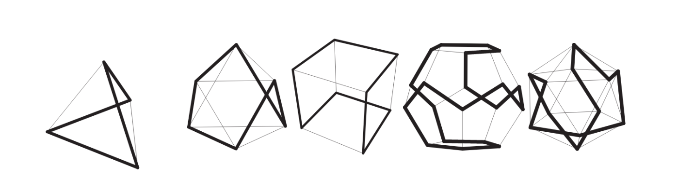

<a name="toc"></a>

<sup><sub><em>Drawing of algorithm</em></sup></sub>

## Table of Contents

- [What if a graph object becomes an artist's muse?](#section-a)
- [Digital Discocubes](#section-b)
- [Command Line Usage](#section-c)
- [Plotting the Solution](#section-d)
- [Dependencies](#section-e)
- [Running Times up to 8 billion](#section-f)
- [Licensing](#section-g)
- [⇓](#section-a)
---

<sup><sub><em>Me and Discocube in Berghain</em></sup></sub>
<br>
<br>
<br>
<a name="section-a"></a>
## [⇪](#toc) What if a graph object becomes an artist's muse?
<small><em>“A great discovery solves a great problem, but there is a grain of discovery in the solution of any problem. Your problem may be modest, but if it challenges your curiosity and brings into play your inventive faculties, and if you solve it by your own means, you may experience the tension and enjoy the triumph of discovery.”</em>

George Pólya: <em>How to Solve It: A New Aspect of Mathematical Method</em></small>

A deterministic and linear-time algorithm for constructing a Hamiltonian cycle on all instances of discocube graphs (tested for graphs with over 8 billion vertices, the world's population). Discocube graphs are
3-dimensional grid graphs derived from: a polycube of an octahedron | a Hauy construction of an octahedron with cubes as identical building blocks | the accretion of cubes around a central cube forming an octahedron at the limit |
the subgraph of the infinite 3-dimensional square grid graph consisting only of points contained within an octahedron | a 3d L1-norm unit ball. 


<sup><sub><em>Planar embedding of a cube and a discocube. From the set of all graphs G, where the order of G is of the ***Uncentered octahedral numbers*** [A130809](https://oeis.org/A130809), only the first two instances shown above; n[0] and n[1] are planarly embeddable i.e., it can be represented on a two-dimensional surface without any of its edges crossing.</em></em></sup>

This algorithm is an artist's rendering of his muse, a graph object, using programming as a language (instead of painting flowers and apples or singing hymns about angels) and a means by which to describe his muse's body as an endless contour drawing or,  in graph theory terms, a Hamiltonian cycle.


<small>Pablo Picasso:  <em>Trois Danseuses (The Three Dancers)</em></small>


<small><em>The graphs from platonic solids are all Hamiltonian.</em></small>

What links an endless contour line drawing and a Hamiltonian cycle? Both entail tracing a path without interruption, using a continuous line to describe the subject/object to be depicted. An endless contour line drawing is one in which the artist uses a single, uninterrupted line to describe a subject's form and shape.
Similarly, a Hamiltonian cycle describes a graph by tracing a path along edges of the graph, visiting vertex precisely once before returning to the beginning vertex. The path connects the vertices in a continuous line, describing the graph object.

<div style="display: flex;">
  <div style="flex: 1;">
    
  </div>
  <div style="flex: 2; padding-left: 20px;">
    <p>
      <em>Named after Sir William Rowan Hamilton, the Hamiltonian cycle problem is a classic graph theory problem solved by finding a closed loop in a graph that visits every node exactly once and ending at the starting point. Hamilton formulated the problem in the rules of his Icosian game, in which players insert numbered pegs into holes on a wooden board to represent steps in a path. The objective is to insert the pegs in order along a path to form a closed loop, much like the Hamiltonian cycle problem where the pegs represent nodes in a graph and the path of inserted pegs represents the cycle.</em>
    </p>
  </div>
</div>

After pages of studies, drawings, and a little math, this algorithm is the result of using the artistic process to solve a mathematical problem without having the means by which to solve it mathematically. A love-child of banging your head against the wall until a hole appears (learning something) and bending the wall with your mind through pure will and imagination (winging it until you fly). When a graph becomes an artist's muse, how does the artist go about rendering their vision as a painter would paint a portrait, making it their own? Can one claim authorship by merely copying a form? If my new material is programming, would functions fill the studio of my mind otherwise filled with machines and material? Will I find patterns in the [music I make from finding solutions?](https://soundcloud.com/ro-yu-489928073/tracks)

https://user-images.githubusercontent.com/93198518/232765984-5b94c0e0-d788-4d1f-a1d3-457600b73daf.mp4

An artist manipulates their medium to create forms, using brush strokes to describe how the curve of the neck disappears behind the back, or playing with colors and contrasts to subtly bring the skin of a subject living 500 years ago back to life. For many, the medium is the end to itself, like painting a painting or photographing a photo, rather than the medium being wholly dependent on the concept or idea to be executed. In my artistic practice the medium used for any particular project is dependent on the first finding the right language and then developing it into a visual language.

In this project, I studied the discocube visually as a body, imagining each turn not as a discrete mathematical object but as a series of possible movements, as an endlessly iterated dance captured in a long camera exposure, resulting in less equating and more doodling, and wishing I knew more math. The result is a family of algorithms for finding Hamiltonian cycles with varying degrees of refinement (edge distribution), with the weave algorithm producing the least refinement. The other algorithms are concerned with finding an initial Hamiltonian cycle with a higher mutation rate and whose edges are more uniformly spread across the three axes x, y, and z, and through subsequent processes, the solution is polished like a diamond, i.e., the initial tour improved upon until the edges are evenly distributed across all three axes, culminating in an always-turning Hamiltonian cycle. Owing to the regularity and consistency of the solution produced by this determined and predictive algorithm, using weave() to obtain a diamond-grade discocube would take an inconceivable period of time, necessitating the development of other algorithms capable of accomplishing this reasonably.


https://user-images.githubusercontent.com/93198518/232767029-a3cc643b-c695-4def-8248-50d0e24ac708.mp4


Why weave? Finding the solution to the problem reminded me of macramé, of tying knots, weaving, and spinning yarn. I thought of how patterns in handwoven fabric are actually unwitting recordings of a knitter's hand movements, like how a piano roll is a recording of the pianist's finger hitting ebony, or how a seismograph records the motion of the earth, or how our skin is a type of recording of our life... I followed the thought further and asked myself: was there a pattern to expose and use to construct the discocube, level by level, similar to how one would knit a scarf, row by row, until the desired result is reached? To illustrate the intention of the code succinctly, I've structured the code to mimic the process of weaving a piece of tapestry, from spinning the yarn to incorporating the weft into the warps.


*The first eleven discocubes and their respective orders (number of nodes)*

To paraphrase Hauy: 

*When solving problems that involve analyzing how nature progresses, we are led by very rapid methods to results that are not immediately obvious. These results may appear paradoxical and surprising. However, if we take the time to carefully examine the steps we took to reach these results, we will begin to understand the underlying principles that led to these outcomes. By going back over the process step by step, we can better understand the logic behind the final results.*

What started as a hack-your-own version of a depth-first search with shortcuts for the discocube graph (solving up to 960 vertices) metastasized into pages of overgrown mixin classes mysteriously coupled to each other like overgrown vines, pushing me deeper and deeper into the underbelly of its mutant tentacles. Although able to solve instances with over a million vertices, the algorithm had the clarity of primordial soup. So, as a sadistic gardener, I painstakingly pruned my own pubicity (my unescapable web of thorny vines) into presentable tiny bonsai trees. So what is a bonsai if not a tree in intimate scope?

https://user-images.githubusercontent.com/93198518/232765555-511aaf82-6276-45b7-96c4-3a8865eebe0d.mp4

The result of this creative process is a family of algorithms developed specifically to solve various graph problems on dodecahedron graphs, 3D grid graphs, and hexprism honeycomb diamond graphs.
The algorithm presented in this repository is the least complex, making it the fastest. It does the job, solving the Hamiltonian cycle problem for over millions of vertices in seconds and graphing with over a billion vertices in less than an hour and a graph with over 8 billion vertices in less than 5 hours, while other algorithms in the family take longer but also have other objectives, like forming an always-turning cycle with even edge distribution across all axes. But that's beyond the scope of this repository.


<sup><sub><em>Detail for a Hamiltonian cycle for a graph with 79,040 nodes.</em></sup></sub>

This algorithm has no while loops and will terminate after a definitive set of steps. The strength of this algorithm is knowing exactly when, where, and what is to happen, thereby reducing the amount of calculations needed (which is surprising as the creative process in creating this was anything but deterministic). It is a construction algorithm, constructing the path layer by layer until loops are produced, which are then joined using cycle merging. Further optimizations of the algorithm have also discarded the memory-heavy adjacency list, choosing instead to perform individual calculations where needed. Making and solving a graph with over a billion vertices, where n = 1000, won't require a distributed graph engine on the cloud anymore, and it takes a little over ten minutes.
<br>
<br>
<br>
### [⇪](#toc) Links


*Discocubes 8 - 1760*


*Hexprism Honeycomb Diamond*
<br>
<br>
<br>
<a name="section-b"></a>
## [⇪](#toc) digital discocubes  
[Play around and inspect a digital discocube here](https://playcanvas.com/model-viewer?load=https://raw.githubusercontent.com/discocube/weaver/main/imgs/snow3641.glb)

As each solution is as unique as a fingerprint, or a diamond it allows one to have their own digital version of a discocube, which is also an instruction for building your own.

 

*Discocubes as glb, using different mirrored texture yields personalized results and unique reflections meaning each discocube has its own reflection/shadow fingerprint! With millions of combinations available (glass texture/image/color, mirror texture/image/color, edge texture/image/color), the possibilities are endless!*

The always turning hamiltonian cycle digital discocubes are not produced by the algorithm in this repository, but by another polynomial-time algorithm.
<br>
<br>
<br>
<a name="section-c"></a>

## [⇪](#toc) Command line usage
To use the package via the command line, navigate to the root directory of the project in your terminal and run the following command:
```
cargo run --release [Graph start instance] [Graph end instance] [steps] [repeats]
```
```
cargo run --release 1 100 1 100
```
<em>For each graph starting from 32 to 1.373 million vertices solve each graph order in steps of one and running each 100x to get the best time.</em>
<br>
<br>
<br>
<a name="section-d"></a>
## [⇪](#toc) Plotting the solution
The solution can be plotted using [this](https://github.com/discocube/plot_solution) python module to visualize and check the solution.
<br>
<br>
<br>
<a name="section-e"></a>
## [⇪](#toc) Dependencies

This repository uses the following crates (ordered by most to least used) for which it is grateful.

<em>For iterator traits, ndarrays, matrix operations on ndarrays, and parallelizing sequential computations:</em>
- [`itertools`](https://docs.rs/itertools/latest/itertools/)    Extra iterator adaptors, functions and macros.
- [`rayon`](https://docs.rs/rayon/latest/rayon/)    Data-parallelism library for parallelizing sequential computations whilst guaranteeing data-race freedom. 
- [`ndarray`](https://docs.rs/ndarray/latest/ndarray/)    Provides an n-dimensional container for general elements and for numerics.

<em>For serializing and writing to</em> `.csv` <em>file:</em>
- [`csv`](https://docs.rs/csv/latest/csv/)    Fast and flexible CSV reader and writer, with support for Serde.
- [`serde`](https://docs.rs/serde/latest/serde/)    Framework for serializing and deserializing Rust data structures efficiently and generically.

<em>For timestamping:</em>
- [`chrono`](https://docs.rs/chrono/latest/chrono/)    A feature-complete superset of the time library.
<br>
<br>
<a name="section-f"></a>

## [⇪](#toc) Running times


<small>Running times from 8 to over 8 billion vertices</small> 
<br>
<br>

### [⇪](#toc) Running times for graphs with 8 to over 8 billion vertices (solved in under 1 hour)

```
| 🇳    1 | ⭕️          8 | 🕗 0.0000121670 
| 🇳    2 | ⭕️         32 | 🕗 0.0000336670 
| 🇳    3 | ⭕️         80 | 🕗 0.0000556250 
| 🇳    4 | ⭕️        160 | 🕗 0.0000860830 
| 🇳    5 | ⭕️        280 | 🕗 0.0001728340 
| 🇳    6 | ⭕️        448 | 🕗 0.0002152500 
| 🇳    7 | ⭕️        672 | 🕗 0.0002383330 
| 🇳    8 | ⭕️        960 | 🕗 0.0002807920 
| 🇳    9 | ⭕️       1320 | 🕗 0.0003124580 
| 🇳   10 | ⭕️       1760 | 🕗 0.0003534590 
| 🇳   11 | ⭕️       2288 | 🕗 0.0003796250 
| 🇳   12 | ⭕️       2912 | 🕗 0.0004421670 
| 🇳   13 | ⭕️       3640 | 🕗 0.0004606250 
| 🇳   14 | ⭕️       4480 | 🕗 0.0005024590 
| 🇳   15 | ⭕️       5440 | 🕗 0.0005727920 
| 🇳   16 | ⭕️       6528 | 🕗 0.0006797920 
| 🇳   17 | ⭕️       7752 | 🕗 0.0006532500 
| 🇳   18 | ⭕️       9120 | 🕗 0.0006986670 
| 🇳   19 | ⭕️      10640 | 🕗 0.0008152920 
| 🇳   20 | ⭕️      12320 | 🕗 0.0008502500 
| 🇳   21 | ⭕️      14168 | 🕗 0.0009908330 
| 🇳   22 | ⭕️      16192 | 🕗 0.0009650000 
| 🇳   23 | ⭕️      18400 | 🕗 0.0011169170 
| 🇳   24 | ⭕️      20800 | 🕗 0.0011144590 
| 🇳   25 | ⭕️      23400 | 🕗 0.0011674589 
| 🇳   26 | ⭕️      26208 | 🕗 0.0013020000 
| 🇳   27 | ⭕️      29232 | 🕗 0.0013477500 
| 🇳   28 | ⭕️      32480 | 🕗 0.0014275840 
| 🇳   29 | ⭕️      35960 | 🕗 0.0014958750 
| 🇳   30 | ⭕️      39680 | 🕗 0.0014919169 
| 🇳   31 | ⭕️      43648 | 🕗 0.0015422500 
| 🇳   32 | ⭕️      47872 | 🕗 0.0016930420 
| 🇳   33 | ⭕️      52360 | 🕗 0.0017866250 
| 🇳   34 | ⭕️      57120 | 🕗 0.0018867080 
| 🇳   35 | ⭕️      62160 | 🕗 0.0020575831 
| 🇳   36 | ⭕️      67488 | 🕗 0.0020389170 
| 🇳   37 | ⭕️      73112 | 🕗 0.0022446250 
| 🇳   38 | ⭕️      79040 | 🕗 0.0022678750 
| 🇳   39 | ⭕️      85280 | 🕗 0.0024716251 
| 🇳   40 | ⭕️      91840 | 🕗 0.0025920840 
| 🇳   41 | ⭕️      98728 | 🕗 0.0026535830 
| 🇳   42 | ⭕️     105952 | 🕗 0.0027707920 
| 🇳   43 | ⭕️     113520 | 🕗 0.0029962501 
| 🇳   44 | ⭕️     121440 | 🕗 0.0029682911 
| 🇳   45 | ⭕️     129720 | 🕗 0.0033047090 
| 🇳   46 | ⭕️     138368 | 🕗 0.0034581251 
| 🇳   47 | ⭕️     147392 | 🕗 0.0036917501 
| 🇳   48 | ⭕️     156800 | 🕗 0.0038126251 
| 🇳   49 | ⭕️     166600 | 🕗 0.0039234171 
| 🇳   50 | ⭕️     176800 | 🕗 0.0039170841 
| 🇳   51 | ⭕️     187408 | 🕗 0.0042002499 
| 🇳   52 | ⭕️     198432 | 🕗 0.0043289168 
| 🇳   53 | ⭕️     209880 | 🕗 0.0043575000 
| 🇳   54 | ⭕️     221760 | 🕗 0.0045866668 
| 🇳   55 | ⭕️     234080 | 🕗 0.0048543750 
| 🇳   56 | ⭕️     246848 | 🕗 0.0049461662 
| 🇳   57 | ⭕️     260072 | 🕗 0.0054035839 
| 🇳   58 | ⭕️     273760 | 🕗 0.0055786660 
| 🇳   59 | ⭕️     287920 | 🕗 0.0055797920 
| 🇳   60 | ⭕️     302560 | 🕗 0.0060125832 
| 🇳   61 | ⭕️     317688 | 🕗 0.0062666670 
| 🇳   62 | ⭕️     333312 | 🕗 0.0064859171 
| 🇳   63 | ⭕️     349440 | 🕗 0.0067297500 
| 🇳   64 | ⭕️     366080 | 🕗 0.0070810001 
| 🇳   65 | ⭕️     383240 | 🕗 0.0073842080 
| 🇳   66 | ⭕️     400928 | 🕗 0.0075188749 
| 🇳   67 | ⭕️     419152 | 🕗 0.0080193747 
| 🇳   68 | ⭕️     437920 | 🕗 0.0091587501 
| 🇳   69 | ⭕️     457240 | 🕗 0.0094685405 
| 🇳   70 | ⭕️     477120 | 🕗 0.0086249169 
| 🇳   71 | ⭕️     497568 | 🕗 0.0091080833 
| 🇳   72 | ⭕️     518592 | 🕗 0.0094844159 
| 🇳   73 | ⭕️     540200 | 🕗 0.0098849582 
| 🇳   74 | ⭕️     562400 | 🕗 0.0103974165 
| 🇳   75 | ⭕️     585200 | 🕗 0.0107163750 
| 🇳   76 | ⭕️     608608 | 🕗 0.0108824996 
| 🇳   77 | ⭕️     632632 | 🕗 0.0113353329 
| 🇳   78 | ⭕️     657280 | 🕗 0.0114379581 
| 🇳   79 | ⭕️     682560 | 🕗 0.0119424583 
| 🇳   80 | ⭕️     708480 | 🕗 0.0127124172 
| 🇳   81 | ⭕️     735048 | 🕗 0.0130524170 
| 🇳   82 | ⭕️     762272 | 🕗 0.0137428343 
| 🇳   83 | ⭕️     790160 | 🕗 0.0139735406 
| 🇳   84 | ⭕️     818720 | 🕗 0.0146117499 
| 🇳   85 | ⭕️     847960 | 🕗 0.0145710828 
| 🇳   86 | ⭕️     877888 | 🕗 0.0154153341 
| 🇳   87 | ⭕️     908512 | 🕗 0.0159500837 
| 🇳   88 | ⭕️     939840 | 🕗 0.0162739586 
| 🇳   89 | ⭕️     971880 | 🕗 0.0171253756 
| 🇳   90 | ⭕️    1004640 | 🕗 0.0177017916 
| 🇳   91 | ⭕️    1038128 | 🕗 0.0178309605 
| 🇳   92 | ⭕️    1072352 | 🕗 0.0184610840 
| 🇳   93 | ⭕️    1107320 | 🕗 0.0192627925 
| 🇳   94 | ⭕️    1143040 | 🕗 0.0196390003 
| 🇳   95 | ⭕️    1179520 | 🕗 0.0203737915 
| 🇳   96 | ⭕️    1216768 | 🕗 0.0208999999 
| 🇳   97 | ⭕️    1254792 | 🕗 0.0215984602 
| 🇳   98 | ⭕️    1293600 | 🕗 0.0222403761 
| 🇳   99 | ⭕️    1333200 | 🕗 0.0230612494 
| 🇳  100 | ⭕️    1373600 | 🕗 0.0237264577 
| 🇳  101 | ⭕️    1414808 | 🕗 0.0241850000 
| 🇳  102 | ⭕️    1456832 | 🕗 0.0250747073 
| 🇳  103 | ⭕️    1499680 | 🕗 0.0259533338 
| 🇳  104 | ⭕️    1543360 | 🕗 0.0269267503 
| 🇳  105 | ⭕️    1587880 | 🕗 0.0275232922 
| 🇳  106 | ⭕️    1633248 | 🕗 0.0281232502 
| 🇳  107 | ⭕️    1679472 | 🕗 0.0291454587 
| 🇳  108 | ⭕️    1726560 | 🕗 0.0296714995 
| 🇳  109 | ⭕️    1774520 | 🕗 0.0304882079 
| 🇳  110 | ⭕️    1823360 | 🕗 0.0312354155 
| 🇳  111 | ⭕️    1873088 | 🕗 0.0320182070 
| 🇳  112 | ⭕️    1923712 | 🕗 0.0330021679 
| 🇳  113 | ⭕️    1975240 | 🕗 0.0342445411 
| 🇳  114 | ⭕️    2027680 | 🕗 0.0350919999 
| 🇳  115 | ⭕️    2081040 | 🕗 0.0360104553 
| 🇳  116 | ⭕️    2135328 | 🕗 0.0369302928 
| 🇳  117 | ⭕️    2190552 | 🕗 0.0381915830 
| 🇳  118 | ⭕️    2246720 | 🕗 0.0385576226 
| 🇳  119 | ⭕️    2303840 | 🕗 0.0401081257 
| 🇳  120 | ⭕️    2361920 | 🕗 0.0406793319 
| 🇳  121 | ⭕️    2420968 | 🕗 0.0421322919 
| 🇳  122 | ⭕️    2480992 | 🕗 0.0432262495 
| 🇳  123 | ⭕️    2542000 | 🕗 0.0448335856 
| 🇳  124 | ⭕️    2604000 | 🕗 0.0458601229 
| 🇳  125 | ⭕️    2667000 | 🕗 0.0467119589 
| 🇳  126 | ⭕️    2731008 | 🕗 0.0481842496 
| 🇳  127 | ⭕️    2796032 | 🕗 0.0490408763 
| 🇳  128 | ⭕️    2862080 | 🕗 0.0506184176 
| 🇳  129 | ⭕️    2929160 | 🕗 0.0517759174 
| 🇳  130 | ⭕️    2997280 | 🕗 0.0529624149 
| 🇳  131 | ⭕️    3066448 | 🕗 0.0550655387 
| 🇳  132 | ⭕️    3136672 | 🕗 0.0554944165 
| 🇳  133 | ⭕️    3207960 | 🕗 0.0574050397 
| 🇳  134 | ⭕️    3280320 | 🕗 0.0590833314 
| 🇳  135 | ⭕️    3353760 | 🕗 0.0595314987 
| 🇳  136 | ⭕️    3428288 | 🕗 0.0616207533 
| 🇳  137 | ⭕️    3503912 | 🕗 0.0627114177 
| 🇳  138 | ⭕️    3580640 | 🕗 0.0649086237 
| 🇳  139 | ⭕️    3658480 | 🕗 0.0664635450 
| 🇳  140 | ⭕️    3737440 | 🕗 0.0669075847 
| 🇳  141 | ⭕️    3817528 | 🕗 0.0695139617 
| 🇳  142 | ⭕️    3898752 | 🕗 0.0711619630 
| 🇳  143 | ⭕️    3981120 | 🕗 0.0727650821 
| 🇳  144 | ⭕️    4064640 | 🕗 0.0747104138 
| 🇳  145 | ⭕️    4149320 | 🕗 0.0756006241 
| 🇳  146 | ⭕️    4235168 | 🕗 0.0783675835 
| 🇳  147 | ⭕️    4322192 | 🕗 0.0801399201 
| 🇳  148 | ⭕️    4410400 | 🕗 0.0825362056 
| 🇳  149 | ⭕️    4499800 | 🕗 0.0837670788 
| 🇳  150 | ⭕️    4590400 | 🕗 0.0853706226 
| 🇳  151 | ⭕️    4682208 | 🕗 0.0879387930 
| 🇳  152 | ⭕️    4775232 | 🕗 0.0900958702 
| 🇳  153 | ⭕️    4869480 | 🕗 0.0924538299 
| 🇳  154 | ⭕️    4964960 | 🕗 0.0951462910 
| 🇳  155 | ⭕️    5061680 | 🕗 0.0967189595 
| 🇳  156 | ⭕️    5159648 | 🕗 0.0988397151 
| 🇳  157 | ⭕️    5258872 | 🕗 0.1019583791 
| 🇳  158 | ⭕️    5359360 | 🕗 0.1027188748 
| 🇳  159 | ⭕️    5461120 | 🕗 0.1059616208 
| 🇳  160 | ⭕️    5564160 | 🕗 0.1081095040 
| 🇳  161 | ⭕️    5668488 | 🕗 0.1102593392 
| 🇳  162 | ⭕️    5774112 | 🕗 0.1126611307 
| 🇳  163 | ⭕️    5881040 | 🕗 0.1150461286 
| 🇳  164 | ⭕️    5989280 | 🕗 0.1181682497 
| 🇳  165 | ⭕️    6098840 | 🕗 0.1205536276 
| 🇳  166 | ⭕️    6209728 | 🕗 0.1237108335 
| 🇳  167 | ⭕️    6321952 | 🕗 0.1253125370 
| 🇳  168 | ⭕️    6435520 | 🕗 0.1278068274 
| 🇳  169 | ⭕️    6550440 | 🕗 0.1313734204 
| 🇳  170 | ⭕️    6666720 | 🕗 0.1344302148 
| 🇳  171 | ⭕️    6784368 | 🕗 0.1370944977 
| 🇳  172 | ⭕️    6903392 | 🕗 0.1395644099 
| 🇳  173 | ⭕️    7023800 | 🕗 0.1428508759 
| 🇳  174 | ⭕️    7145600 | 🕗 0.1446470916 
| 🇳  175 | ⭕️    7268800 | 🕗 0.1485457122 
| 🇳  176 | ⭕️    7393408 | 🕗 0.1515042037 
| 🇳  177 | ⭕️    7519432 | 🕗 0.1547876298 
| 🇳  178 | ⭕️    7646880 | 🕗 0.1581035405 
| 🇳  179 | ⭕️    7775760 | 🕗 0.1609414220 
| 🇳  180 | ⭕️    7906080 | 🕗 0.1643581241 
| 🇳  181 | ⭕️    8037848 | 🕗 0.1674534231 
| 🇳  182 | ⭕️    8171072 | 🕗 0.1702348739 
| 🇳  183 | ⭕️    8305760 | 🕗 0.1744350940 
| 🇳  184 | ⭕️    8441920 | 🕗 0.1764109582 
| 🇳  185 | ⭕️    8579560 | 🕗 0.1822682619 
| 🇳  186 | ⭕️    8718688 | 🕗 0.1858128011 
| 🇳  187 | ⭕️    8859312 | 🕗 0.1893977076 
| 🇳  188 | ⭕️    9001440 | 🕗 0.1925365478 
| 🇳  189 | ⭕️    9145080 | 🕗 0.1966986209 
| 🇳  190 | ⭕️    9290240 | 🕗 0.2020906210 
| 🇳  191 | ⭕️    9436928 | 🕗 0.2058481574 
| 🇳  192 | ⭕️    9585152 | 🕗 0.2081409991 
| 🇳  193 | ⭕️    9734920 | 🕗 0.2135929614 
| 🇳  194 | ⭕️    9886240 | 🕗 0.2167537063 
| 🇳  195 | ⭕️   10039120 | 🕗 0.2204166204 
| 🇳  196 | ⭕️   10193568 | 🕗 0.2253544927 
| 🇳  197 | ⭕️   10349592 | 🕗 0.2297920436 
| 🇳  198 | ⭕️   10507200 | 🕗 0.2340660542 
| 🇳  199 | ⭕️   10666400 | 🕗 0.2374149561 
| 🇳  200 | ⭕️   10827200 | 🕗 0.2429190129 
| 🇳  201 | ⭕️   10989608 | 🕗 0.2486662567 
| 🇳  202 | ⭕️   11153632 | 🕗 0.2522604764 
| 🇳  203 | ⭕️   11319280 | 🕗 0.2565264702 
| 🇳  204 | ⭕️   11486560 | 🕗 0.2610530257 
| 🇳  205 | ⭕️   11655480 | 🕗 0.2666850388 
| 🇳  206 | ⭕️   11826048 | 🕗 0.2696547210 
| 🇳  207 | ⭕️   11998272 | 🕗 0.2757692039 
| 🇳  208 | ⭕️   12172160 | 🕗 0.2815547585 
| 🇳  209 | ⭕️   12347720 | 🕗 0.2862318456 
| 🇳  210 | ⭕️   12524960 | 🕗 0.2915490866 
| 🇳  211 | ⭕️   12703888 | 🕗 0.2969746590 
| 🇳  212 | ⭕️   12884512 | 🕗 0.3020814955 
| 🇳  213 | ⭕️   13066840 | 🕗 0.3068147600 
| 🇳  214 | ⭕️   13250880 | 🕗 0.3128221631 
| 🇳  215 | ⭕️   13436640 | 🕗 0.3169069588 
| 🇳  216 | ⭕️   13624128 | 🕗 0.3231490850 
| 🇳  217 | ⭕️   13813352 | 🕗 0.3292649388 
| 🇳  218 | ⭕️   14004320 | 🕗 0.3355272114 
| 🇳  219 | ⭕️   14197040 | 🕗 0.3442309499 
| 🇳  220 | ⭕️   14391520 | 🕗 0.3481214046 
| 🇳  221 | ⭕️   14587768 | 🕗 0.3518816829 
| 🇳  222 | ⭕️   14785792 | 🕗 0.3584341705 
| 🇳  223 | ⭕️   14985600 | 🕗 0.3655003309 
| 🇳  224 | ⭕️   15187200 | 🕗 0.3700094819 
| 🇳  225 | ⭕️   15390600 | 🕗 0.3760042489 
| 🇳  226 | ⭕️   15595808 | 🕗 0.3842642903 
| 🇳  227 | ⭕️   15802832 | 🕗 0.3881231546 
| 🇳  228 | ⭕️   16011680 | 🕗 0.3951343596 
| 🇳  229 | ⭕️   16222360 | 🕗 0.4000105858 
| 🇳  230 | ⭕️   16434880 | 🕗 0.4087437987 
| 🇳  231 | ⭕️   16649248 | 🕗 0.4144673347 
| 🇳  232 | ⭕️   16865472 | 🕗 0.4193789363 
| 🇳  233 | ⭕️   17083560 | 🕗 0.4283965230 
| 🇳  234 | ⭕️   17303520 | 🕗 0.4355364442 
| 🇳  235 | ⭕️   17525360 | 🕗 0.4420328736 
| 🇳  236 | ⭕️   17749088 | 🕗 0.4497081339 
| 🇳  237 | ⭕️   17974712 | 🕗 0.4586576819 
| 🇳  238 | ⭕️   18202240 | 🕗 0.4644054174 
| 🇳  239 | ⭕️   18431680 | 🕗 0.4720064402 
| 🇳  240 | ⭕️   18663040 | 🕗 0.4793971479 
| 🇳  241 | ⭕️   18896328 | 🕗 0.4870021641 
| 🇳  242 | ⭕️   19131552 | 🕗 0.4953063130 
| 🇳  243 | ⭕️   19368720 | 🕗 0.5006814003 
| 🇳  244 | ⭕️   19607840 | 🕗 0.5105180740 
| 🇳  245 | ⭕️   19848920 | 🕗 0.5178053379 
| 🇳  246 | ⭕️   20091968 | 🕗 0.5275897980 
| 🇳  247 | ⭕️   20336992 | 🕗 0.5355270505 
| 🇳  248 | ⭕️   20584000 | 🕗 0.5422776937 
| 🇳  249 | ⭕️   20833000 | 🕗 0.5512285233 
| 🇳  250 | ⭕️   21084000 | 🕗 0.5612413883 
| 🇳  251 | ⭕️   21337008 | 🕗 0.5668765903 
| 🇳  252 | ⭕️   21592032 | 🕗 0.5786451101 
| 🇳  253 | ⭕️   21849080 | 🕗 0.5857163668 
| 🇳  254 | ⭕️   22108160 | 🕗 0.5941022635 
| 🇳  255 | ⭕️   22369280 | 🕗 0.6033035517 
| 🇳  256 | ⭕️   22632448 | 🕗 0.6252706647 
| 🇳  257 | ⭕️   22897672 | 🕗 0.6327763200 
| 🇳  258 | ⭕️   23164960 | 🕗 0.6434557438 
| 🇳  259 | ⭕️   23434320 | 🕗 0.6519679427 
| 🇳  260 | ⭕️   23705760 | 🕗 0.6610835791 
| 🇳  261 | ⭕️   23979288 | 🕗 0.6737011075 
| 🇳  262 | ⭕️   24254912 | 🕗 0.6827772856 
| 🇳  263 | ⭕️   24532640 | 🕗 0.6937137246 
| 🇳  264 | ⭕️   24812480 | 🕗 0.7061291337 
| 🇳  265 | ⭕️   25094440 | 🕗 0.7181665301 
| 🇳  266 | ⭕️   25378528 | 🕗 0.7214239240 
| 🇳  267 | ⭕️   25664752 | 🕗 0.7408060431 
| 🇳  268 | ⭕️   25953120 | 🕗 0.7548851967 
| 🇳  269 | ⭕️   26243640 | 🕗 0.7708546519 
| 🇳  270 | ⭕️   26536320 | 🕗 0.7776065469 
| 🇳  271 | ⭕️   26831168 | 🕗 0.7914184332 
| 🇳  272 | ⭕️   27128192 | 🕗 0.7949767709 
| 🇳  273 | ⭕️   27427400 | 🕗 0.8101597428 
| 🇳  274 | ⭕️   27728800 | 🕗 0.8232811093 
| 🇳  275 | ⭕️   28032400 | 🕗 0.8323560357 
| 🇳  276 | ⭕️   28338208 | 🕗 0.8405999541 
| 🇳  277 | ⭕️   28646232 | 🕗 0.8595604300 
| 🇳  278 | ⭕️   28956480 | 🕗 0.8712547421 
| 🇳  279 | ⭕️   29268960 | 🕗 0.8897573352 
| 🇳  280 | ⭕️   29583680 | 🕗 0.9022457004 
| 🇳  281 | ⭕️   29900648 | 🕗 0.9105177522 
| 🇳  282 | ⭕️   30219872 | 🕗 0.9232621193 
| 🇳  283 | ⭕️   30541360 | 🕗 0.9378010631 
| 🇳  284 | ⭕️   30865120 | 🕗 0.9549767971 
| 🇳  285 | ⭕️   31191160 | 🕗 0.9584531784 
| 🇳  286 | ⭕️   31519488 | 🕗 0.9730947018 
| 🇳  287 | ⭕️   31850112 | 🕗 0.9911147952 
| 🇳  288 | ⭕️   32183040 | 🕗 1.0046166182 
| 🇳  289 | ⭕️   32518280 | 🕗 1.0104249716 
| 🇳  290 | ⭕️   32855840 | 🕗 1.0377593040 
| 🇳  291 | ⭕️   33195728 | 🕗 1.0476689339 
| 🇳  292 | ⭕️   33537952 | 🕗 1.0634326935 
| 🇳  293 | ⭕️   33882520 | 🕗 1.0750583410 
| 🇳  294 | ⭕️   34229440 | 🕗 1.0891497135 
| 🇳  295 | ⭕️   34578720 | 🕗 1.1051938534 
| 🇳  296 | ⭕️   34930368 | 🕗 1.1190025806 
| 🇳  297 | ⭕️   35284392 | 🕗 1.1377320290 
| 🇳  298 | ⭕️   35640800 | 🕗 1.1448394060 
| 🇳  299 | ⭕️   35999600 | 🕗 1.1700984240 
| 🇳  300 | ⭕️   36360800 | 🕗 1.1781280041 
| 🇳  301 | ⭕️   36724408 | 🕗 1.1975694895 
| 🇳  302 | ⭕️   37090432 | 🕗 1.2077808380 
| 🇳  303 | ⭕️   37458880 | 🕗 1.2310798168 
| 🇳  304 | ⭕️   37829760 | 🕗 1.2437727451 
| 🇳  305 | ⭕️   38203080 | 🕗 1.2562892437 
| 🇳  306 | ⭕️   38578848 | 🕗 1.2775118351 
| 🇳  307 | ⭕️   38957072 | 🕗 1.2918379307 
| 🇳  308 | ⭕️   39337760 | 🕗 1.3126298189 
| 🇳  309 | ⭕️   39720920 | 🕗 1.3313826323 
| 🇳  310 | ⭕️   40106560 | 🕗 1.3432358503 
| 🇳  311 | ⭕️   40494688 | 🕗 1.3551286459 
| 🇳  312 | ⭕️   40885312 | 🕗 1.3776762486 
| 🇳  313 | ⭕️   41278440 | 🕗 1.3859341145 
| 🇳  314 | ⭕️   41674080 | 🕗 1.4143201113 
| 🇳  315 | ⭕️   42072240 | 🕗 1.4270088673 
| 🇳  316 | ⭕️   42472928 | 🕗 1.4452447891 
| 🇳  317 | ⭕️   42876152 | 🕗 1.4563241005 
| 🇳  318 | ⭕️   43281920 | 🕗 1.4832894802 
| 🇳  319 | ⭕️   43690240 | 🕗 1.5032505989 
| 🇳  320 | ⭕️   44101120 | 🕗 1.4987275600 
| 🇳  321 | ⭕️   44514568 | 🕗 1.5415856838 
| 🇳  322 | ⭕️   44930592 | 🕗 1.5574114323 
| 🇳  323 | ⭕️   45349200 | 🕗 1.5809527636 
| 🇳  324 | ⭕️   45770400 | 🕗 1.5889067650 
| 🇳  325 | ⭕️   46194200 | 🕗 1.6091566086 
| 🇳  326 | ⭕️   46620608 | 🕗 1.6281342506 
| 🇳  327 | ⭕️   47049632 | 🕗 1.6434062719 
| 🇳  328 | ⭕️   47481280 | 🕗 1.6657049656 
| 🇳  329 | ⭕️   47915560 | 🕗 1.6852111816 
| 🇳  330 | ⭕️   48352480 | 🕗 1.6988587379 
| 🇳  331 | ⭕️   48792048 | 🕗 1.7205665112 
| 🇳  332 | ⭕️   49234272 | 🕗 1.7402656078 
| 🇳  333 | ⭕️   49679160 | 🕗 1.7440986633 
| 🇳  334 | ⭕️   50126720 | 🕗 1.7606859207 
| 🇳  335 | ⭕️   50576960 | 🕗 1.7603950500 
| 🇳  336 | ⭕️   51029888 | 🕗 1.7924468517 
| 🇳  337 | ⭕️   51485512 | 🕗 1.8042736053 
| 🇳  338 | ⭕️   51943840 | 🕗 1.8152449131 
| 🇳  339 | ⭕️   52404880 | 🕗 1.8430088758 
| 🇳  340 | ⭕️   52868640 | 🕗 1.8608152866 
| 🇳  341 | ⭕️   53335128 | 🕗 1.8804984093 
| 🇳  342 | ⭕️   53804352 | 🕗 1.8971538544 
| 🇳  343 | ⭕️   54276320 | 🕗 1.9238594770 
| 🇳  344 | ⭕️   54751040 | 🕗 1.9492731094 
| 🇳  345 | ⭕️   55228520 | 🕗 1.9652727842 
| 🇳  346 | ⭕️   55708768 | 🕗 1.9872024059 
| 🇳  347 | ⭕️   56191792 | 🕗 2.0084447861 
| 🇳  348 | ⭕️   56677600 | 🕗 2.0305397511 
| 🇳  349 | ⭕️   57166200 | 🕗 2.0602569580 
| 🇳  350 | ⭕️   57657600 | 🕗 2.0797111988 
| 🇳  351 | ⭕️   58151808 | 🕗 2.0990145206 
| 🇳  352 | ⭕️   58648832 | 🕗 2.1228535175 
| 🇳  353 | ⭕️   59148680 | 🕗 2.1440532207 
| 🇳  354 | ⭕️   59651360 | 🕗 2.1542353630 
| 🇳  355 | ⭕️   60156880 | 🕗 2.1813373566 
| 🇳  356 | ⭕️   60665248 | 🕗 2.2163894176 
| 🇳  357 | ⭕️   61176472 | 🕗 2.2290546894 
| 🇳  358 | ⭕️   61690560 | 🕗 2.2577862740 
| 🇳  359 | ⭕️   62207520 | 🕗 2.2764096260 
| 🇳  360 | ⭕️   62727360 | 🕗 2.3054440022 
| 🇳  361 | ⭕️   63250088 | 🕗 2.3209156990 
| 🇳  362 | ⭕️   63775712 | 🕗 2.3474292755 
| 🇳  363 | ⭕️   64304240 | 🕗 2.3677115440 
| 🇳  364 | ⭕️   64835680 | 🕗 2.4003891945 
| 🇳  365 | ⭕️   65370040 | 🕗 2.4228780270 
| 🇳  366 | ⭕️   65907328 | 🕗 2.4527673721 
| 🇳  367 | ⭕️   66447552 | 🕗 2.4714524746 
| 🇳  368 | ⭕️   66990720 | 🕗 2.5030930042 
| 🇳  369 | ⭕️   67536840 | 🕗 2.5241811275 
| 🇳  370 | ⭕️   68085920 | 🕗 2.5526947975 
| 🇳  371 | ⭕️   68637968 | 🕗 2.5826325417 
| 🇳  372 | ⭕️   69192992 | 🕗 2.6038544178 
| 🇳  373 | ⭕️   69751000 | 🕗 2.6332132816 
| 🇳  374 | ⭕️   70312000 | 🕗 2.6593961716 
| 🇳  375 | ⭕️   70876000 | 🕗 2.6879386902 
| 🇳  376 | ⭕️   71443008 | 🕗 2.7146666050 
| 🇳  377 | ⭕️   72013032 | 🕗 2.7563600540 
| 🇳  378 | ⭕️   72586080 | 🕗 2.7757461071 
| 🇳  379 | ⭕️   73162160 | 🕗 2.7977271080 
| 🇳  380 | ⭕️   73741280 | 🕗 2.8362705708 
| 🇳  381 | ⭕️   74323448 | 🕗 2.8553814888 
| 🇳  382 | ⭕️   74908672 | 🕗 2.8915631771 
| 🇳  383 | ⭕️   75496960 | 🕗 2.9218170643 
| 🇳  384 | ⭕️   76088320 | 🕗 2.9435520172 
| 🇳  385 | ⭕️   76682760 | 🕗 2.9808762074 
| 🇳  386 | ⭕️   77280288 | 🕗 3.0130045414 
| 🇳  387 | ⭕️   77880912 | 🕗 3.0382304192 
| 🇳  388 | ⭕️   78484640 | 🕗 3.0813434124 
| 🇳  389 | ⭕️   79091480 | 🕗 3.0979421139 
| 🇳  390 | ⭕️   79701440 | 🕗 3.1379735470 
| 🇳  391 | ⭕️   80314528 | 🕗 3.1679635048 
| 🇳  392 | ⭕️   80930752 | 🕗 3.1992635727 
| 🇳  393 | ⭕️   81550120 | 🕗 3.2300934792 
| 🇳  394 | ⭕️   82172640 | 🕗 3.2542500496 
| 🇳  395 | ⭕️   82798320 | 🕗 3.2980310917 
| 🇳  396 | ⭕️   83427168 | 🕗 3.3268754482 
| 🇳  397 | ⭕️   84059192 | 🕗 3.3620347977 
| 🇳  398 | ⭕️   84694400 | 🕗 3.3948915005 
| 🇳  399 | ⭕️   85332800 | 🕗 3.4242134094 
| 🇳  400 | ⭕️   85974400 | 🕗 3.4592323303 
| 🇳  401 | ⭕️   86619208 | 🕗 3.4899778366 
| 🇳  402 | ⭕️   87267232 | 🕗 3.5227410793 
| 🇳  403 | ⭕️   87918480 | 🕗 3.5635776520 
| 🇳  404 | ⭕️   88572960 | 🕗 3.5935065746 
| 🇳  405 | ⭕️   89230680 | 🕗 3.6327414513 
| 🇳  406 | ⭕️   89891648 | 🕗 3.6607322693 
| 🇳  407 | ⭕️   90555872 | 🕗 3.6933164597 
| 🇳  408 | ⭕️   91223360 | 🕗 3.7418606281 
| 🇳  409 | ⭕️   91894120 | 🕗 3.7638649940 
| 🇳  410 | ⭕️   92568160 | 🕗 3.8051760197 
| 🇳  411 | ⭕️   93245488 | 🕗 3.8393759727 
| 🇳  412 | ⭕️   93926112 | 🕗 3.8652687073 
| 🇳  413 | ⭕️   94610040 | 🕗 3.9112775326 
| 🇳  414 | ⭕️   95297280 | 🕗 3.9450783730 
| 🇳  415 | ⭕️   95987840 | 🕗 3.9859733582 
| 🇳  416 | ⭕️   96681728 | 🕗 4.0158762932 
| 🇳  417 | ⭕️   97378952 | 🕗 4.0553226471 
| 🇳  418 | ⭕️   98079520 | 🕗 4.0899710655 
| 🇳  419 | ⭕️   98783440 | 🕗 4.1247377396 
| 🇳  420 | ⭕️   99490720 | 🕗 4.1694235802 
| 🇳  421 | ⭕️  100201368 | 🕗 4.2037181854 
| 🇳  422 | ⭕️  100915392 | 🕗 4.2537355423 
| 🇳  423 | ⭕️  101632800 | 🕗 4.2907476425 
| 🇳  424 | ⭕️  102353600 | 🕗 4.3410701752 
| 🇳  425 | ⭕️  103077800 | 🕗 4.4085803032 
| 🇳  426 | ⭕️  103805408 | 🕗 4.4271612167 
| 🇳  427 | ⭕️  104536432 | 🕗 4.4607510567 
| 🇳  428 | ⭕️  105270880 | 🕗 4.5109295845 
| 🇳  429 | ⭕️  106008760 | 🕗 4.5306105614 
| 🇳  430 | ⭕️  106750080 | 🕗 4.5749878883 
| 🇳  431 | ⭕️  107494848 | 🕗 4.6500787735 
| 🇳  432 | ⭕️  108243072 | 🕗 4.6717743874 
| 🇳  433 | ⭕️  108994760 | 🕗 4.7238435745 
| 🇳  434 | ⭕️  109749920 | 🕗 4.7592077255 
| 🇳  435 | ⭕️  110508560 | 🕗 4.7970252037 
| 🇳  436 | ⭕️  111270688 | 🕗 4.8226242065 
| 🇳  437 | ⭕️  112036312 | 🕗 4.8673853874 
| 🇳  438 | ⭕️  112805440 | 🕗 4.9161777496 
| 🇳  439 | ⭕️  113578080 | 🕗 4.9609446526 
| 🇳  440 | ⭕️  114354240 | 🕗 5.0242443085 
| 🇳  441 | ⭕️  115133928 | 🕗 5.0692362785 
| 🇳  442 | ⭕️  115917152 | 🕗 5.1170597076 
| 🇳  443 | ⭕️  116703920 | 🕗 5.1668162346 
| 🇳  444 | ⭕️  117494240 | 🕗 5.1868915558 
| 🇳  445 | ⭕️  118288120 | 🕗 5.2363333702 
| 🇳  446 | ⭕️  119085568 | 🕗 5.2728896141 
| 🇳  447 | ⭕️  119886592 | 🕗 5.3395667076 
| 🇳  448 | ⭕️  120691200 | 🕗 5.3689684868 
| 🇳  449 | ⭕️  121499400 | 🕗 5.4454574585 
| 🇳  450 | ⭕️  122311200 | 🕗 5.4567236900 
| 🇳  451 | ⭕️  123126608 | 🕗 5.5140542984 
| 🇳  452 | ⭕️  123945632 | 🕗 5.5848412514 
| 🇳  453 | ⭕️  124768280 | 🕗 5.6180467606 
| 🇳  454 | ⭕️  125594560 | 🕗 5.7027635574 
| 🇳  455 | ⭕️  126424480 | 🕗 5.7007894516 
| 🇳  456 | ⭕️  127258048 | 🕗 5.7667279243 
| 🇳  457 | ⭕️  128095272 | 🕗 5.8025741577 
| 🇳  458 | ⭕️  128936160 | 🕗 5.8558149338 
| 🇳  459 | ⭕️  129780720 | 🕗 5.9396958351 
| 🇳  460 | ⭕️  130628960 | 🕗 5.9576253891 
| 🇳  461 | ⭕️  131480888 | 🕗 5.9992723465 
| 🇳  462 | ⭕️  132336512 | 🕗 6.0377497673 
| 🇳  463 | ⭕️  133195840 | 🕗 6.0959258080 
| 🇳  464 | ⭕️  134058880 | 🕗 6.1883983612 
| 🇳  465 | ⭕️  134925640 | 🕗 6.2206907272 
| 🇳  466 | ⭕️  135796128 | 🕗 6.2725119591 
| 🇳  467 | ⭕️  136670352 | 🕗 6.2992658615 
| 🇳  468 | ⭕️  137548320 | 🕗 6.3347177505 
| 🇳  469 | ⭕️  138430040 | 🕗 6.4146580696 
| 🇳  470 | ⭕️  139315520 | 🕗 6.4513297081 
| 🇳  471 | ⭕️  140204768 | 🕗 6.5426158905 
| 🇳  472 | ⭕️  141097792 | 🕗 6.5523233414 
| 🇳  473 | ⭕️  141994600 | 🕗 6.6255145073 
| 🇳  474 | ⭕️  142895200 | 🕗 6.6785917282 
| 🇳  475 | ⭕️  143799600 | 🕗 6.7110738754 
| 🇳  476 | ⭕️  144707808 | 🕗 6.8051223755 
| 🇳  477 | ⭕️  145619832 | 🕗 6.8102507591 
| 🇳  478 | ⭕️  146535680 | 🕗 6.8606562614 
| 🇳  479 | ⭕️  147455360 | 🕗 6.9208254814 
| 🇳  480 | ⭕️  148378880 | 🕗 6.9970793724 
| 🇳  481 | ⭕️  149306248 | 🕗 7.0476222038 
| 🇳  482 | ⭕️  150237472 | 🕗 7.1175599098 
| 🇳  483 | ⭕️  151172560 | 🕗 7.1777501106 
| 🇳  484 | ⭕️  152111520 | 🕗 7.2448754311 
| 🇳  485 | ⭕️  153054360 | 🕗 7.2952923775 
| 🇳  486 | ⭕️  154001088 | 🕗 7.3523969650 
| 🇳  487 | ⭕️  154951712 | 🕗 7.4165315628 
| 🇳  488 | ⭕️  155906240 | 🕗 7.4655795097 
| 🇳  489 | ⭕️  156864680 | 🕗 7.5236325264 
| 🇳  490 | ⭕️  157827040 | 🕗 7.5819687843 
| 🇳  491 | ⭕️  158793328 | 🕗 7.6839604378 
| 🇳  492 | ⭕️  159763552 | 🕗 7.7059221268 
| 🇳  493 | ⭕️  160737720 | 🕗 7.7312030792 
| 🇳  494 | ⭕️  161715840 | 🕗 7.8410520554 
| 🇳  495 | ⭕️  162697920 | 🕗 7.8767709732 
| 🇳  496 | ⭕️  163683968 | 🕗 7.9313440323 
| 🇳  497 | ⭕️  164673992 | 🕗 8.0396604538 
| 🇳  498 | ⭕️  165668000 | 🕗 8.0553207397 
| 🇳  499 | ⭕️  166666000 | 🕗 8.1096744537 
| 🇳  500 | ⭕️  167668000 | 🕗 8.1465568542 
| 🇳  600 | ⭕️  289441600 | 🕗 17.5048580170 
| 🇳  700 | ⭕️  459295200 | 🕗 35.5125579834 
| 🇳  800 | ⭕️  685228800 | 🕗 116.5416107178 
| 🇳  900 | ⭕️  975242400 | 🕗 174.7076110840 
| 🇳 1000 | ⭕️ 1337336000 | 🕗 240.5564362585 
| 🇳 1100 | ⭕️ 1779509600 | 🕗 324.5367092784 
| 🇳 1200 | ⭕️ 2309763200 | 🕗 434.1448342025 
| 🇳 1300 | ⭕️ 2936096800 | 🕗 527.8912534102 
| 🇳 1400 | ⭕️ 3666510400 | 🕗 660.1129210170 
| 🇳 1500 | ⭕️ 4509004000 | 🕗 816.2368340823 
| 🇳 1600 | ⭕️ 5471577600 | 🕗 1001.091214897 
| 🇳 1700 | ⭕️ 6562231200 | 🕗 1332.292241911 
| 🇳 1800 | ⭕️ 7788964800 | 🕗 1638.822858899 
| 🇳 1900 | ⭕️ 9159778400 | 🕗 1987.633434514 
```
<br>
<br>
<br>
<a name="section-g"></a>

## [⇪](#toc) Licensing

This package is licensed under the MIT license.
 
Thanks for making it this far!
